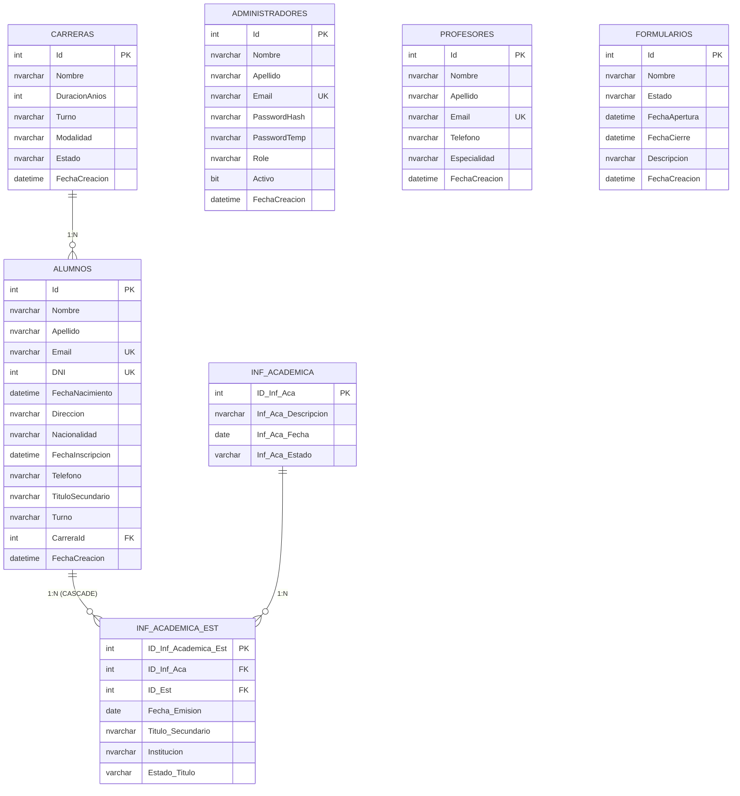

# Base de Datos — InstitutoDB

> Última actualización: 2026-10-02
> Motor: SQL Server 2022
> Instancia: `localhost` (default)
> Usuario: `instituto_user` / `Instituto2026`
> Módulo Información Académica documentado en [`INFORMACION_ACADEMICA.md`](./INFORMACION_ACADEMICA.md)

---

## 1. Inventario de Tablas

| Tabla | Columnas | Registros | FKs Salientes | FKs Entrantes | Índices Únicos |
|-------|----------|-----------|---------------|---------------|----------------|
| Administradores | 9 | 4 | 0 | 0 | 2 |
| Alumnos | 14 | 4 | 1 | 1 | 2 |
| Carreras | 8 | 4 | 0 | 1 | 1 |
| Formularios | 7 | 2 | 0 | 0 | 1 |
| Profesores | 7 | 3 | 0 | 0 | 2 |
| **Inf_Academica** | 4 | 4 | 0 | 1 | 1 |
| **Inf_Academica_Est** | 7 | 0 | 2 | 0 | 2 |

---

## 2. Relaciones (Foreign Keys)

| Nombre FK | Tabla Hija | Columna Hija | Tabla Padre | Columna Padre | ON DELETE | ON UPDATE |
|-----------|------------|--------------|-------------|---------------|-----------|-----------|
| FK_Alumnos_Carreras | Alumnos | CarreraId | Carreras | Id | NO_ACTION | NO_ACTION |
| FK_InfAcademicaEst_InfAcademica | Inf_Academica_Est | ID_Inf_Aca | Inf_Academica | ID_Inf_Aca | NO_ACTION | NO_ACTION |
| FK_InfAcademicaEst_Alumnos | Inf_Academica_Est | ID_Est | Alumnos | Id | **CASCADE** | NO_ACTION |

**Diagrama de relaciones:**



> **Notas:**
> - `FK_Alumnos_Carreras` → `Carreras(Id)` con `ON DELETE NO ACTION`
> - `FK_InfAcademicaEst_InfAcademica` → `Inf_Academica(ID_Inf_Aca)` con `ON DELETE NO ACTION`
> - `FK_InfAcademicaEst_Alumnos` → `Alumnos(Id)` con **`ON DELETE CASCADE`**

## 3. Estructura Detallada por Tabla

### 3.1 Administradores

| Columna | Tipo | Longitud | Nullable | Identity | Restricción | Default |
|---------|------|----------|----------|----------|-------------|---------|
| Id | int |  | NO | SÍ | PK |  |
| Nombre | nvarchar | 100 | NO |  |  |  |
| Apellido | nvarchar | 100 | NO |  |  |  |
| Email | nvarchar | 150 | NO |  | UNIQUE (parcial) |  |
| PasswordHash | nvarchar | 255 | NO |  |  |  |
| PasswordTemp | nvarchar | 255 | SÍ |  |  |  |
| Role | nvarchar | 50 | NO |  |  | 'Admin' |
| Activo | bit |  | NO |  |  | 1 |
| FechaCreacion | datetime |  | NO |  |  | GETDATE() |

**Índices UNIQUE:**
- `PK__Administ__...`  Primary Key sobre `Id`.
- `UQ_Administradores_Email_Activo`  UNIQUE parcial sobre `Email WHERE Activo = 1`.

**Notas:**
- Implementa **soft delete** (borrar = `Activo = 0`).
- El índice UNIQUE parcial permite reutilizar emails de registros inactivos.
- **Todas las SPs que devuelven `Administrador` deben incluir `PasswordTemp`** (aunque sea NULL), porque EF Core lo exige por estar mapeado en el `DbContext`.

---

### 3.2 Alumnos

| Columna | Tipo | Longitud | Nullable | Identity | Restricción | Default |
|---------|------|----------|----------|----------|-------------|---------|
| Id | int |  | NO | SÍ | PK |  |
| Nombre | nvarchar | 100 | NO |  |  |  |
| Apellido | nvarchar | 100 | NO |  |  |  |
| Email | nvarchar | 150 | NO |  | UNIQUE |  |
| DNI | int |  | NO |  | UNIQUE |  |
| FechaNacimiento | datetime |  | NO |  |  |  |
| Direccion | nvarchar | 200 | SÍ |  |  |  |
| Nacionalidad | nvarchar | 100 | SÍ |  |  |  |
| FechaInscripcion | datetime |  | SÍ |  |  | GETDATE() |
| Telefono | nvarchar | 50 | SÍ |  |  |  |
| TituloSecundario | nvarchar | 200 | SÍ |  |  |  |
| Turno | nvarchar | 50 | SÍ |  |  |  |
| CarreraId | int |  | NO |  | **FK**  Carreras.Id |  |
| FechaCreacion | datetime |  | NO |  |  | GETDATE() |

**Relaciones:**
- FK_Alumnos_Carreras  Carreras(Id)
- FK_InfAcademicaEst_Alumnos  Inf_Academica_Est (ON DELETE CASCADE)

**Notas:**
- `FechaInscripcion` se completa con `GETDATE()` si no se informa.
- El campo `TituloSecundario` queda como legacy; el módulo de información académica lo reemplaza por un catálogo (`Inf_Academica`) + registros por alumno (`Inf_Academica_Est`).

---

### 3.3 Carreras

| Columna | Tipo | Longitud | Nullable | Identity | Restricción | Default |
|---------|------|----------|----------|----------|-------------|---------|
| Id | int |  | NO | SÍ | PK |  |
| Nombre | nvarchar | 200 | NO |  |  |  |
| DuracionAnios | int |  | NO |  |  |  |
| Turno | nvarchar | 50 | SÍ |  |  |  |
| Modalidad | nvarchar | 50 | SÍ |  |  |  |
| Horario | nvarchar | 100 | SÍ |  |  |  |
| Estado | nvarchar | 50 | SÍ |  |  | 'Activa' |
| FechaCreacion | datetime |  | NO |  |  | GETDATE() |

**Nota:** No usa soft delete. Al eliminar, la FK de Alumnos impide la operación si hay alumnos asociados.

---

### 3.4 Formularios

| Columna | Tipo | Longitud | Nullable | Identity | Restricción | Default |
|---------|------|----------|----------|----------|-------------|---------|
| Id | int |  | NO | SÍ | PK |  |
| Nombre | nvarchar | 200 | NO |  |  |  |
| Estado | nvarchar | 50 | NO |  |  | 'Borrador' |
| FechaApertura | datetime |  | NO |  |  |  |
| FechaCierre | datetime |  | NO |  |  |  |
| Descripcion | nvarchar | 500 | SÍ |  |  |  |
| FechaCreacion | datetime |  | NO |  |  | GETDATE() |

**Estados válidos:** `Borrador`, `Abierto`, `Cerrado`.

---

### 3.5 Profesores

| Columna | Tipo | Longitud | Nullable | Identity | Restricción | Default |
|---------|------|----------|----------|----------|-------------|---------|
| Id | int |  | NO | SÍ | PK |  |
| Nombre | nvarchar | 100 | NO |  |  |  |
| Apellido | nvarchar | 100 | NO |  |  |  |
| Email | nvarchar | 150 | NO |  | UNIQUE |  |
| Telefono | nvarchar | 50 | SÍ |  |  |  |
| Especialidad | nvarchar | 100 | SÍ |  |  |  |
| FechaCreacion | datetime |  | NO |  |  | GETDATE() |

---

### 3.6 Inf_Academica (catálogo de tipos)

Catálogo configurable de tipos de información académica. Agregado en 2026-10.

| Columna | Tipo | Longitud | Nullable | Identity | Restricción | Default |
|---------|------|----------|----------|----------|-------------|---------|
| ID_Inf_Aca | int |  | NO | SÍ | PK |  |
| Inf_Aca_Descripcion | nvarchar | 100 | NO |  |  |  |
| Inf_Aca_Fecha | date |  | NO |  |  |  |
| Inf_Aca_Estado | varchar | 15 | NO |  |  | 'DESHABILITADO' |

**Valores permitidos de `Inf_Aca_Estado`:** `HABILITADO`, `DESHABILITADO`.

**Datos iniciales:**

| ID | Descripción | Estado |
|----|-------------|--------|
| 1 | Título | HABILITADO |
| 2 | Título en trámite | HABILITADO |
| 3 | Constancia de materias adeudadas | HABILITADO |
| 4 | Constancia de alumno regular | HABILITADO |

---

### 3.7 Inf_Academica_Est (registros por alumno)

Registro de cada tipo académico que un alumno posee, con su estado y fecha.

| Columna | Tipo | Longitud | Nullable | Identity | Restricción | Default |
|---------|------|----------|----------|----------|-------------|---------|
| ID_Inf_Academica_Est | int |  | NO | SÍ | PK |  |
| ID_Inf_Aca | int |  | NO |  | **FK**  Inf_Academica |  |
| ID_Est | int |  | NO |  | **FK**  Alumnos (CASCADE) |  |
| Fecha_Emision | date |  | NO |  |  |  |
| Titulo_Secundario | nvarchar | 100 | SÍ |  |  |  |
| Institucion | nvarchar | 150 | SÍ |  |  |  |
| Estado_Titulo | varchar | 15 | NO |  |  |  |

**Valores permitidos de `Estado_Titulo`:** `TRAMITE`, `MANO`, `PAUSA`.

**Reglas de campos por tipo** (validadas en BR, no en BD):

| Tipo | `Titulo_Secundario` | `Institucion` |
|------|---------------------|---------------|
| Título | **Obligatorio** (100) | NULL |
| Título en trámite | NULL | **Obligatorio** (150) |
| Constancias | NULL | NULL |

**Índices UNIQUE:**
- `PK_Inf_Academica_Est`  Primary Key sobre `ID_Inf_Academica_Est`.
- `UQ_InfAcademicaEst_InfAca_Est`  UNIQUE `(ID_Inf_Aca, ID_Est)`  un alumno no puede repetir tipo.

**Notas:**
- `Inf_Academica_Est_Update` **no recibe `ID_Est`**: el alumno de un registro es inmutable (ni siquiera a nivel SP).
- `ON DELETE CASCADE`: si se borra un alumno, se borran sus registros académicos.

---

## 4. Stored Procedures — Inventario

### 4.1 SPs base (script `sp_stored_procedures.sql`)

| SP | Tipo | Notas |
|----|------|-------|
| `sp_Carreras_{GetAll, GetById, Create, Update, Delete, Exists}` | CRUD + Exists |  |
| `sp_Alumnos_{GetAll, GetById, Create, Update, Delete, Exists, ExistsByDNI, ExistsByEmail, ExistsByCarreraId}` | CRUD + Exists | `Create` usa `@FechaInscripcionFinal` (no redeclarar el parámetro `@FechaInscripcion`) |
| `sp_Administradores_{GetAll, GetById, GetByEmail, Create, Update, UpdatePasswordHash, SoftDelete, ExistsByEmail, Count}` | CRUD + Soft delete + Auth | **`GetAll`, `GetById`, `GetByEmail` deben devolver `PasswordTemp`** |
| `sp_Profesores_{GetAll, GetById, Create, Update, Delete, Exists, ExistsByEmail}` | CRUD + Exists |  |
| `sp_Formularios_{GetAll, GetById, Create, Update, Delete, Exists}` | CRUD + Exists |  |
| `sp_Listado_GetAll` | SELECT (join) | **Reescrito en el script 2** (ver sección 5) |

### 4.2 SPs de información académica (script `04_InfAcademica.sql`)

| SP | Tipo | Notas |
|----|------|-------|
| `Inf_Academica_{List, GetById, Insert, Update, Delete}` | CRUD catálogo |  |
| `Inf_Academica_Est_{List, GetById, GetByAlumno, Insert, Update, Delete}` | CRUD registros | `Update` **no recibe `ID_Est`** |
| `Inf_Academica_Est_Exists` | Exists |  |
| `Inf_Academica_Est_ExistsByCombination` | Exists | Recibe `@ExcludeId` opcional para validar al editar |
| `Inf_Academica_Est_ExistsByInfAca` | Exists | Para no borrar tipos con registros |

### 4.3 Reglas de oro de las SPs

| Regla | Aplicación |
|-------|-----------|
| **Solo Data Access** | Cero validaciones de negocio en SPs |
| **Validaciones en BR** | `InfAcademicaValidator.cs`, `InfAcademicaEstService.cs`, `InscripcionService.cs` |
| **`SET NOCOUNT ON`** | Al inicio de cada SP |
| **`SCOPE_IDENTITY()`** | Devuelve el ID en `INSERT` |
| **Alias seguros** | Nunca usar palabras reservadas (`Exists`)  usar `AS Result` |
| **Columnas requeridas por EF** | Toda columna mapeada en `InstitutoDbContext.cs` debe aparecer en el `SELECT` |

---

## 5. Reescritura de `sp_Listado_GetAll`

**Versión antigua:**
```sql
SELECT a.Id, a.Nombre + ' ' + a.Apellido, a.DNI, a.Email, c.Nombre, a.Turno,
       FLOOR(DATEDIFF(DAY, a.FechaNacimiento, GETDATE()) / 365.25) AS Edad
FROM Alumnos a LEFT JOIN Carreras c ON a.CarreraId = c.Id
```
 1 fila por alumno, edad calculada en SQL.

**Versión nueva:**
```sql
SELECT a.Id AS AlumnoId,
       a.Nombre + ' ' + a.Apellido AS NombreCompleto,
       a.DNI, a.Email,
       c.Nombre AS Carrera, a.Turno, a.FechaNacimiento,
       ia.Inf_Aca_Descripcion AS TipoAcademico,
       iae.Titulo_Secundario AS TituloSecundario,
       iae.Fecha_Emision AS FechaEmision,
       iae.Estado_Titulo AS EstadoTitulo
FROM Alumnos a
LEFT JOIN Carreras c ON a.CarreraId = c.Id
LEFT JOIN Inf_Academica_Est iae ON iae.ID_Est = a.Id
LEFT JOIN Inf_Academica ia ON ia.ID_Inf_Aca = iae.ID_Inf_Aca
```
 **N filas por alumno** (una por registro académico, o una con NULLs), edad y prioridad calculadas en **BR** (`ListadoService.cs`).

**Columnas devueltas:**

| Columna | Tipo | Origen |
|---------|------|--------|
| `AlumnoId` | int | Alumnos.Id |
| `NombreCompleto` | nvarchar | Alumnos.Nombre + ' ' + Alumnos.Apellido |
| `DNI` | int | Alumnos.DNI |
| `Email` | nvarchar | Alumnos.Email |
| `Carrera` | nvarchar | Carreras.Nombre (NULL si no tiene) |
| `Turno` | nvarchar | Alumnos.Turno |
| `FechaNacimiento` | datetime | Alumnos.FechaNacimiento |
| `TipoAcademico` | nvarchar | Inf_Academica.Inf_Aca_Descripcion (NULL si no tiene) |
| `TituloSecundario` | nvarchar | Inf_Academica_Est.Titulo_Secundario |
| `FechaEmision` | date | Inf_Academica_Est.Fecha_Emision |
| `EstadoTitulo` | varchar | Inf_Academica_Est.Estado_Titulo |

---

## 6. Datos Actuales (Snapshot 2026-10-02)

### 6.1 Carreras (4 registros)

| Id | Nombre | Duración | Turno | Modalidad | Horario | Estado |
|----|--------|----------|-------|-----------|---------|--------|
| 1 | Tecnicatura Superior en Desarrollo de Software | 3 años | Noche | Presencial | 18:30 a 22:30 | Activa |
| 2 | Tecnicatura Superior en Enfermería | 3 años | Mañana | Presencial | 08:00 a 13:00 | Activa |
| 3 | Tecnicatura Superior en Administración de Empresas | 3 años | Tarde | Mixta | 14:00 a 18:30 | Activa |
| 4 | Profesorado en Educación Inicial | 4 años | Mañana | Presencial | 08:00 a 13:30 | Activa |

### 6.2 Administradores

| Id | Nombre | Apellido | Email | Role | Activo | Estado |
|----|--------|----------|-------|------|--------|--------|
| 16 | isaac | Acevedo Rengifo | admin@instituto.edu.ar | Admin | 0 | Soft delete |
| 17 | isaac | Acevedo Rengifo | admin@tupac.edu.ar | SuperAdmin | 1 | Activo |
| 20 | Tahiel | Cassata | isa@test.com | Admin | 0 | Soft delete |
| 21 | Tahiel | Cassata | isa@test.com | Admin | 1 | Activo |

> **Nota:** El email `isa@test.com` aparece 2 veces (Id 20 inactivo + Id 21 activo).
> Eso es posible gracias al índice UNIQUE parcial `WHERE Activo = 1`.

### 6.3 Alumnos (4 registros)

| Id | Nombre | Apellido | DNI | Turno | CarreraId | Carrera |
|----|--------|----------|-----|-------|-----------|---------|
| 1 | Ana | Martínez | 40123456 | Noche | 1 | Desarrollo de Software |
| 2 | Pedro | López | 41234567 | Noche | 1 | Desarrollo de Software |
| 3 | Lucía | Fernández | 42345678 | Mañana | 2 | Enfermería |
| 4 | Diego | Sánchez | 43456789 | Tarde | 3 | Administración |

### 6.4 Profesores (3 registros)

| Id | Nombre | Apellido | Email | Teléfono | Especialidad |
|----|--------|----------|-------|----------|--------------|
| 1 | Juan | Pérez | juan.perez@tupac.edu.ar | 3814567890 | Programación |
| 2 | María | González | maria.gonzalez@tupac.edu.ar | 3814567891 | Enfermería |
| 3 | Carlos | Rodríguez | carlos.rodriguez@tupac.edu.ar | 3814567892 | Matemáticas |

### 6.5 Formularios (2 registros)

| Id | Nombre | Estado | FechaApertura | FechaCierre |
|----|--------|--------|---------------|-------------|
| 1 | Inscripción 2026 - Primer Cuatrimestre | Cerrado | 2026-09-27 | 2026-09-30 |
| 2 | Inscripción 2026 - Segundo Cuatrimestre | Borrador | 2026-06-01 | 2026-08-31 |

### 6.6 Inf_Academica (catálogo, 4 tipos)

| ID_Inf_Aca | Inf_Aca_Descripcion | Inf_Aca_Estado |
|------------|---------------------|----------------|
| 1 | Título | HABILITADO |
| 2 | Título en trámite | HABILITADO |
| 3 | Constancia de materias adeudadas | HABILITADO |
| 4 | Constancia de alumno regular | HABILITADO |

### 6.7 Inf_Academica_Est (registros por alumno)

*Sin registros al 2026-10-02. Se cargan vía inscripción pública o CRUD admin.*

---

## 7. Script para Recrear la Base desde Cero

**Orden de ejecución:**

1. **Crear la base** (DDL de tablas base, ver sección 7.1).
2. `Docs/sql/sp_stored_procedures.sql`  SPs base.
3. `Docs/sql/04_InfAcademica.sql`  Tablas académicas + catálogo + SPs académicas + reescritura de `sp_Listado_GetAll`.

### 7.1 DDL de tablas base

```sql
-- 
-- CREAR BASE
-- 
CREATE DATABASE InstitutoDB;
GO
USE InstitutoDB;
GO

-- 
-- TABLAS BASE
-- 

CREATE TABLE dbo.Carreras (
    Id            INT IDENTITY(1,1) PRIMARY KEY,
    Nombre        NVARCHAR(200) NOT NULL,
    DuracionAnios INT NOT NULL,
    Turno         NVARCHAR(50) NULL,
    Modalidad     NVARCHAR(50) NULL,
    Horario       NVARCHAR(100) NULL,
    Estado        NVARCHAR(50) NULL DEFAULT 'Activa',
    FechaCreacion DATETIME NOT NULL DEFAULT GETDATE()
);

CREATE TABLE dbo.Administradores (
    Id            INT IDENTITY(1,1) PRIMARY KEY,
    Nombre        NVARCHAR(100) NOT NULL,
    Apellido      NVARCHAR(100) NOT NULL,
    Email         NVARCHAR(150) NOT NULL,
    PasswordHash  NVARCHAR(255) NOT NULL,
    PasswordTemp  NVARCHAR(255) NULL,
    Role          NVARCHAR(50) NOT NULL DEFAULT 'Admin',
    Activo        BIT NOT NULL DEFAULT 1,
    FechaCreacion DATETIME NOT NULL DEFAULT GETDATE()
);

CREATE UNIQUE INDEX UQ_Administradores_Email_Activo
ON dbo.Administradores(Email)
WHERE Activo = 1;

CREATE TABLE dbo.Alumnos (
    Id               INT IDENTITY(1,1) PRIMARY KEY,
    Nombre           NVARCHAR(100) NOT NULL,
    Apellido         NVARCHAR(100) NOT NULL,
    Email            NVARCHAR(150) NOT NULL UNIQUE,
    DNI              INT NOT NULL UNIQUE,
    FechaNacimiento  DATETIME NOT NULL,
    Direccion        NVARCHAR(200) NULL,
    Nacionalidad     NVARCHAR(100) NULL,
    FechaInscripcion DATETIME NULL DEFAULT GETDATE(),
    Telefono         NVARCHAR(50) NULL,
    TituloSecundario NVARCHAR(200) NULL,
    Turno            NVARCHAR(50) NULL,
    CarreraId        INT NOT NULL,
    FechaCreacion    DATETIME NOT NULL DEFAULT GETDATE(),
    CONSTRAINT FK_Alumnos_Carreras
        FOREIGN KEY (CarreraId) REFERENCES dbo.Carreras(Id)
);

CREATE TABLE dbo.Profesores (
    Id            INT IDENTITY(1,1) PRIMARY KEY,
    Nombre        NVARCHAR(100) NOT NULL,
    Apellido      NVARCHAR(100) NOT NULL,
    Email         NVARCHAR(150) NOT NULL UNIQUE,
    Telefono      NVARCHAR(50) NULL,
    Especialidad  NVARCHAR(100) NULL,
    FechaCreacion DATETIME NOT NULL DEFAULT GETDATE()
);

CREATE TABLE dbo.Formularios (
    Id            INT IDENTITY(1,1) PRIMARY KEY,
    Nombre        NVARCHAR(200) NOT NULL,
    Estado        NVARCHAR(50) NOT NULL DEFAULT 'Borrador',
    FechaApertura DATETIME NOT NULL,
    FechaCierre   DATETIME NOT NULL,
    Descripcion   NVARCHAR(500) NULL,
    FechaCreacion DATETIME NOT NULL DEFAULT GETDATE()
);
GO

-- 
-- USUARIO SQL
-- 
CREATE LOGIN instituto_user
WITH PASSWORD = 'Instituto2026', CHECK_POLICY = OFF, CHECK_EXPIRATION = OFF;
GO
CREATE USER instituto_user FOR LOGIN instituto_user;
ALTER ROLE db_owner ADD MEMBER instituto_user;
GO
```

### 7.2 Comando con `sqlcmd` (ejecutar SPs)

```bash
# Ejecutar SPs base
sqlcmd -S localhost -U instituto_user -P Instituto2026 -d InstitutoDB -I -i "Docs/sql/sp_stored_procedures.sql"

# Ejecutar SPs y tablas de info académica
sqlcmd -S localhost -U instituto_user -P Instituto2026 -d InstitutoDB -I -i "Docs/sql/04_InfAcademica.sql"
```

> El flag **`-I`** activa `QUOTED_IDENTIFIER ON`, requerido por el índice UNIQUE filtrado de `Administradores`.

---

## 8. Comandos Útiles de Mantenimiento

**Ver todos los admins (activos e inactivos):**
```sql
SELECT Id, Nombre, Apellido, Email, Role, Activo, FechaCreacion
FROM dbo.Administradores
ORDER BY Id;
```

**Solo admins activos (los que ve el frontend):**
```sql
SELECT Id, Nombre, Apellido, Email, Role
FROM dbo.Administradores
WHERE Activo = 1
ORDER BY Id;
```

**Restaurar un admin soft-deleted:**
```sql
UPDATE dbo.Administradores SET Activo = 1 WHERE Id = 16;
```

**Borrar definitivamente los inactivos:**
```sql
DELETE FROM dbo.Administradores WHERE Activo = 0;
```

**Verificar índices UNIQUE de una tabla:**
```sql
SELECT i.name, i.is_unique, i.has_filter, i.filter_definition
FROM sys.indexes i
WHERE i.object_id = OBJECT_ID('dbo.Administradores') AND i.is_unique = 1;
```

**Ver todo el catálogo académico:**
```sql
SELECT * FROM dbo.Inf_Academica ORDER BY ID_Inf_Aca;
```

**Ver registros académicos de un alumno:**
```sql
SELECT iae.*, ia.Inf_Aca_Descripcion
FROM dbo.Inf_Academica_Est iae
INNER JOIN dbo.Inf_Academica ia ON ia.ID_Inf_Aca = iae.ID_Inf_Aca
WHERE iae.ID_Est = 1
ORDER BY iae.Fecha_Emision DESC;
```

**Ver qué tipos tienen alumnos asignados (para saber cuáles no se pueden borrar):**
```sql
SELECT ia.ID_Inf_Aca, ia.Inf_Aca_Descripcion, COUNT(iae.ID_Inf_Academica_Est) AS Total
FROM dbo.Inf_Academica ia
LEFT JOIN dbo.Inf_Academica_Est iae ON iae.ID_Inf_Aca = ia.ID_Inf_Aca
GROUP BY ia.ID_Inf_Aca, ia.Inf_Aca_Descripcion
ORDER BY ia.ID_Inf_Aca;
```

**Ver alumnos SIN información académica:**
```sql
SELECT a.Id, a.Nombre, a.Apellido, a.DNI
FROM dbo.Alumnos a
LEFT JOIN dbo.Inf_Academica_Est iae ON iae.ID_Est = a.Id
WHERE iae.ID_Inf_Academica_Est IS NULL
ORDER BY a.Id;
```

**Ejecutar la SP del listado:**
```sql
EXEC sp_Listado_GetAll;
```

**Verificar SPs creadas:**
```sql
SELECT name FROM sys.procedures
WHERE name LIKE 'sp_%' OR name LIKE 'Inf_Academica%'
ORDER BY name;
```

---

## 9. Lecciones Aprendidas (Integración EF Core + SPs)

Bugs encontrados durante la integración del módulo de información académica. Documentados para no repetirlos.

| Bug | Causa | Solución |
|-----|-------|----------|
| `'FromSql' or 'SqlQuery' was called with non-composable SQL` | `.FirstOrDefaultAsync()` sobre `EXEC` | Cambiar a `.ToListAsync()` + `.FirstOrDefault()` en memoria |
| `The required column 'PasswordTemp' was not present` | SP no devolvía una columna mapeada por EF | Agregar la columna al `SELECT` de la SP |
| `Sintaxis incorrecta cerca de 'Exists'` | `Exists` es palabra reservada en SQL Server | Usar `AS Result` como alias |
| `@FechaInscripcion` ya declarado | `DECLARE` con el mismo nombre que un parámetro | Usar nombre distinto (`@FechaInscripcionFinal`) |
| Doble creación de registros (Profesor, Formulario) | `ExecuteScalarAsync()` llamado 2 veces en `CreateAsync` | Eliminar la segunda llamada |
| `QUOTED_IDENTIFIER` error en DELETE | Índice UNIQUE filtrado requiere `QUOTED_IDENTIFIER ON` | Ejecutar con `-I` o `SET QUOTED_IDENTIFIER ON` |

**Reglas derivadas:**

1. **Nunca** uses `FirstOrDefaultAsync()` sobre `FromSqlRaw`/`SqlQueryRaw` con `EXEC`. Siempre `ToListAsync()` + `FirstOrDefault()` en memoria.
2. Toda SP que devuelva una entidad **debe incluir todas las columnas mapeadas** (aunque sean `NULL`).
3. Los alias de columnas en SPs **no pueden coincidir con palabras reservadas** de SQL Server.
4. Los parámetros y las variables `DECLARE` **no pueden compartir nombre** en el mismo SP.
5. Llamar `ExecuteScalarAsync()` **una sola vez** por operación.

**Repositorios corregidos (2026-10-02):**

| Archivo | Métodos corregidos |
|---------|-------------------|
| `AdministradorRepository.cs` | `GetByIdAsync`, `GetByEmailAsync`, `ExistsAsync`, `ExistsByEmailAsync`, `CountAsync` |
| `AlumnoRepository.cs` | `GetByIdAsync`, `ExistsAsync`, `ExistsByDNIAsync`, `ExistsByEmailAsync`, `ExistsByCarreraIdAsync` |
| `CarreraRepository.cs` | `GetByIdAsync`, `ExistsAsync` |
| `ProfesorRepository.cs` | `GetByIdAsync`, `ExistsAsync`, `ExistsByEmailAsync` + fix doble `ExecuteScalarAsync()` en `CreateAsync` |
| `FormularioRepository.cs` | `GetByIdAsync`, `ExistsAsync` + fix doble `ExecuteScalarAsync()` en `CreateAsync` |

---

## 10. Contraseñas de Prueba (Desarrollo)

| Email | Contraseña | Rol | Activo |
|-------|------------|-----|--------|
| `admin@tupac.edu.ar` | `Tupac123` | SuperAdmin | Sí |
| `isa@test.com` | (definida al crear) | Admin | Sí |
| `admin@instituto.edu.ar` | (histórica) | Admin | No (soft delete) |

> **Antes de producción:** eliminar todos los usuarios de prueba y crear nuevos con contraseñas seguras.

**Crear el primer admin (solo dev, una sola vez):**
```bash
curl -X POST http://localhost:5127/api/setup/admin \
  -H "Content-Type: application/json" \
  -d '{"nombre":"Super","apellido":"Admin","email":"admin@tupac.edu.ar","password":"Tupac123","role":"SuperAdmin"}'
```

---

## 11. Estadísticas

| Métrica | Valor |
|---------|-------|
| Total tablas | 7 |
| Total columnas | 56 |
| Total registros (base) | 17 |
| Total registros (académica) | 4 (solo catálogo) |
| FKs definidas | 3 |
| Índices UNIQUE | 9 |
| Índices UNIQUE parciales | 1 (`UQ_Administradores_Email_Activo`) |
| Stored Procedures | ~40 (base + académicas) |

---

## 12. Historial de Cambios de la BD

| Fecha | Cambio | Autor |
|-------|--------|-------|
| 2026-09-27 | Creación de la BD con 5 tablas | Equipo |
| 2026-09-27 | Habilitado **Mixed Mode Auth** en SQL Server | Equipo |
| 2026-09-27 | Creado usuario SQL `instituto_user` con `db_owner` | Equipo |
| 2026-09-27 | Implementado **soft delete** en Administradores | Equipo |
| 2026-09-27 | Reemplazado UNIQUE total por **UNIQUE parcial** (`WHERE Activo = 1`) | Equipo |
| 2026-09-27 | Datos de prueba insertados (4 carreras, 4 alumnos, 3 profesores, 2 formularios) | Equipo |
| 2026-09-28 | Documentación actualizada (diagrama ASCII, contraseñas, estructura interfaces) | Equipo |
| 2026-10-02 | **Módulo Información Académica**: tablas `Inf_Academica` + `Inf_Academica_Est`, 14 SPs nuevas, `sp_Listado_GetAll` reescrito con join académico | Equipo |
| 2026-10-02 | **Fix bugs integración EF Core + SPs**: `PasswordTemp`, alias `Result`, `ToListAsync()` sobre EXEC, `@FechaInscripcion` duplicado, doble `ExecuteScalarAsync()` | Equipo |
| 2026-10-02 | Documentación consolidada: 7 tablas, 3 FKs, ~40 SPs, sección de Lecciones Aprendidas | Equipo |
| 2026-10-02 | Reorganización de `DATABASE.md` en carpeta `DATABASE/` con archivos por tema | Equipo |

---

*Documento mantenido por el equipo de desarrollo — Instituto Superior Docente Túpac Amaru (2026)*