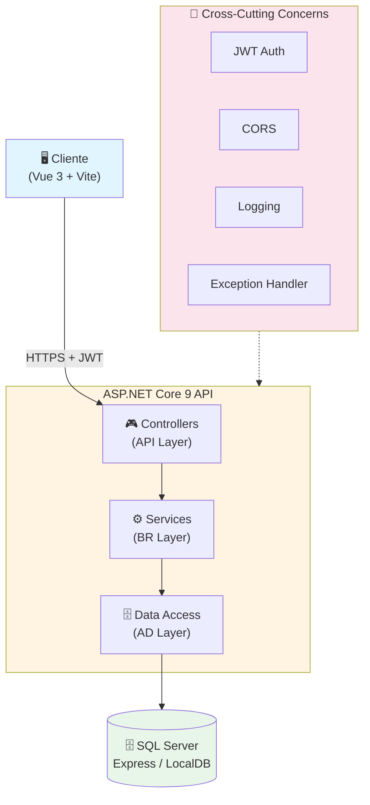
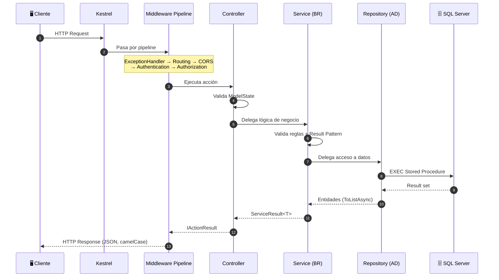

# Visión General de la Arquitectura

## Resumen

El backend del **Instituto Tupac Amaru** es una **API REST** construida con **ASP.NET Core 9** que expone endpoints para la gestión académica de un instituto educativo. Sigue una arquitectura **N-Tier (3 capas)** con separación clara de responsabilidades: **AD (Data Access)** → **BR (Business Rules)** → **API (Presentation)**.

## diagrama de alto nivel



## Estructura de Capas (N-Tier)

| Capa | Proyecto | Responsabilidad | Tecnologías |
|------|----------|-----------------|-------------|
| **API** | `Instituto.API` | Controllers, Middleware, DI, Config, Global Exception Handler | ASP.NET Core 9, JWT, CORS |
| **BR** | `Instituto.BR` | Business Logic, Validaciones, Orquestación, Result Pattern | BCrypt, DTOs, Interfaces |
| **AD** | `Instituto.AD` | Data Access, Repositorios, SQL, ADO.NET (`AccesoDB`) | `Microsoft.Data.SqlClient`, `AccesoDB` |

## Principios de Diseño

| Principio | Implementación |
|-----------|----------------|
| **Separation of Concerns** | Controllers (API) → Services (BR) → Repositories (AD) |
| **Dependency Inversion** | Interfaces `ICrudService<T>`, `IAdministradorService`, `IRepository` |
| **Single Responsibility** | Un servicio por entidad, un controlador por recurso |
| **DRY** | `AccesoDB` base + Repositorios tipados con helpers reutilizables |
| **Security by Default** | `[Authorize]` global (Program.cs), `[AllowAnonymous]` explícito |
| **Fail Fast** | Validaciones tempranas, excepciones tipadas (`EntityNotFoundException`, `PersistenceException`) |
| **Layer Isolation** | API no conoce AD, BR no conoce API ni AD directamente |

## Tecnologías Principales (Versiones Exactas)

| Componente | Tecnología | Versión |
|------------|------------|---------|
| Framework | ASP.NET Core | 9.0 |
| Base de Datos | SQL Server (Express / LocalDB) | 2022+ |
| Data Access | ADO.NET (`Microsoft.Data.SqlClient`) | 5.2+ |
| Auth | JWT Bearer Tokens | 9.0.5 |
| Hashing | BCrypt.Net-Next | 4.0.3 (workFactor: 12) |
| Serialización | System.Text.Json | Built-in (CamelCase) |
| Testing | MSTest + Moq | 3.6+ / 4.20+ |

## Flujo de Request Típico



## Convenciones de Código

- **Naming**: PascalCase para tipos/miembros públicos, camelCase para parámetros/privados
- **Async**: Todas las operaciones I/O son `async`/`await` (excepto AccesoDB que es sync)
- **Nullability**: `<Nullable>enable</Nullable>` en csproj
- **Records**: Para DTOs inmutables (`LoginDto`, `AdminResult`, `SetupAdminDto`, `ServiceResult<T>`)
- **Interfaces**: Prefijo `I` (`IRepository`, `ICrudService<T>`, `IAdministradorService`)
- **Result Pattern**: `ServiceResult<T>` para respuestas de servicios con éxito/fallo tipados
- **Response Wrapper**: `ApiResponse<T>` en controladores (camelCase JSON)

## Configuración Real (appsettings)

```json
// appsettings.Development.json (SQL Auth)
{
  "ConnectionStrings": {
    "SqlServer": "Server=localhost;Database=InstitutoDB;User Id=instituto_user;Password=Instituto2026;TrustServerCertificate=True;"
  },
  "Jwt": {
    "Key": "Tupac@Amaru#Instituto!JWT$2026*Clave&MuySecreta=32chars",
    "Issuer": "InstitutoTupacAmaru",
    "Audience": "InstitutoTupacAmaruAdmin"
  }
}
```

```json
// appsettings.json (LocalDB - Windows Auth)
{
  "ConnectionStrings": {
    "SqlServer": "Server=(localdb)\\MSSQLLocalDB;Database=InstitutoDB;Trusted_Connection=True;TrustServerCertificate=True;"
  }
}
```