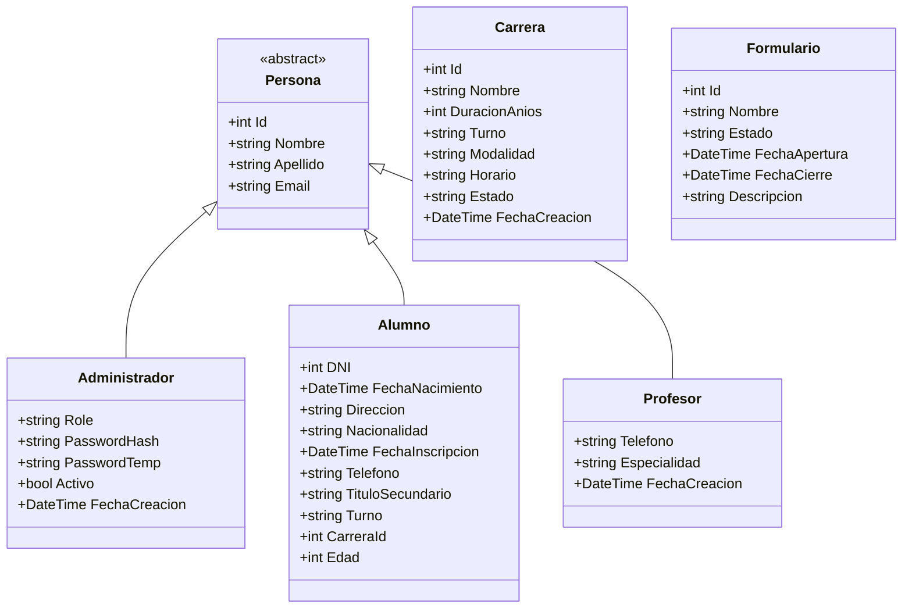

# Estructura del Proyecto Backend (3 Capas: AD → BR → API)

## Árbol de Directorios (Solution)

```
Instituto.sln
├── Instituto.AD/              # Data Access Layer
│   ├── Interfaces/            # Contratos de repositorios
│   │   ├── IRepository.cs
│   │   ├── ICarreraRepository.cs
│   │   ├── IAlumnoRepository.cs
│   │   ├── IAdministradorRepository.cs
│   │   ├── IProfesorRepository.cs
│   │   ├── IFormularioRepository.cs
│   │   └── IListadoRepository.cs
│   ├── Models/                # Entidades de dominio (AD)
│   │   ├── Persona.cs
│   │   ├── Administrador.cs
│   │   ├── Alumno.cs
│   │   ├── Carrera.cs
│   │   ├── Profesor.cs
│   │   ├── Formulario.cs
│   │   └── ListadoItem.cs
│   ├── Repositories/          # Implementaciones ADO.NET
│   │   ├── CarreraRepository.cs
│   │   ├── AlumnoRepository.cs
│   │   ├── AdministradorRepository.cs
│   │   ├── ProfesorRepository.cs
│   │   ├── FormularioRepository.cs
│   │   └── ListadoRepository.cs
│   ├── AccesoDB.cs            # Wrapper ADO.NET (ExecuteReader/NonQuery/Scalar)
│   ├── DBParameter.cs
│   ├── DBParameters.cs
│   ├── Instituto.AD.csproj
│   └── Dependencies: Microsoft.Data.SqlClient
│
├── Instituto.BR/              # Business Rules Layer
│   ├── DTOs/                  # DTOs de servicio (ServiceResult, AdminResult, etc.)
│   │   └── CommonDtos.cs
│   ├── Interfaces/            # Contratos de servicios
│   │   └── IServices.cs
│   ├── Services/              # Implementaciones de lógica de negocio
│   │   ├── CarreraService.cs
│   │   ├── AlumnoService.cs
│   │   ├── AdministradorService.cs
│   │   ├── ProfesorService.cs
│   │   ├── FormularioService.cs
│   │   └── ListadoService.cs
│   ├── Instituto.BR.csproj
│   └── Dependencies: Instituto.AD, BCrypt.Net-Next
│
├── Instituto.MinimalAPI/      # Presentation Layer (ASP.NET Core 9 Minimal APIs)
│   ├── Endpoints/             # Extension methods por dominio
│   │   ├── AuthEndpoints.cs
│   │   ├── SetupEndpoints.cs
│   │   ├── AdminEndpoints.cs
│   │   ├── AlumnoEndpoints.cs
│   │   ├── CarreraEndpoints.cs
│   │   ├── ProfesorEndpoints.cs
│   │   ├── FormularioEndpoints.cs
│   │   ├── ListadoEndpoints.cs
│   │   ├── HealthEndpoints.cs
│   │   └── DebugEndpoints.cs
│   ├── Models/                # DTOs de API (Request/Response)
│   │   └── ApiModels.cs
│   ├── Program.cs             # Composition root + pipeline + DI + CORS + Global Exception Handler
│   ├── appsettings.json       # Config base (LocalDB)
│   ├── appsettings.Development.json  # ConnectionString SQL Auth, JWT
│   ├── Instituto.MinimalAPI.csproj
│   └── Dependencies: Instituto.BR, JWT Bearer, BCrypt.Net-Next
│
├── Instituto.MinimalAPI.Academica/  # API Académica (puerto 5128)
│   ├── Endpoints/             # 12 Endpoint classes por dominio
│   ├── ApiResults.cs          # Wrapper {isSuccess, message, data}
│   ├── Program.cs             # DI académico + Swagger
│   └── Instituto.MinimalAPI.Academica.csproj
│
├── Instituto.AD.Test/         # Unit tests AD (MSTest + Moq)
├── Instituto.BR.Test/         # Unit tests BR (MSTest + Moq)
├── Instituto.MinimalAPI.Test/ # Integration tests API (MSTest + WebApplicationFactory)
│
├── Database/                  # Scripts SQL compartidos
│   └── CreateDatabase.sql     # DDL completo (tablas, índices, FKs)
│
├── Docs/                      # Documentación
└── README.md
```

## Responsabilidades por Capa

### API Layer (`Instituto.MinimalAPI` + `Instituto.MinimalAPI.Academica`)
- **Reciben** HTTP requests, validan entrada
- **Delegan** a servicios BR (no contienen lógica de negocio)
- **Manejan** excepciones de dominio → HTTP status codes
- **Retornan** JSON serializado (`ApiResponse<T>` / `ApiResult<T>`)
- **Middleware**: CORS, Global Exception Handler, Swagger (Dev)
- **Organización**: Endpoints en carpeta `Endpoints/` como extension methods `MapXxxEndpoints(this WebApplication app)`

### BR Layer (`Instituto.BR`)
- **Contienen** lógica de negocio y reglas de validación
- **Orquestan** validaciones cruzadas (ej. Alumno valida Carrera existe)
- **Ejecutan** operaciones via Repositories (AD)
- **Manejan** `ServiceResult<T>` pattern para éxito/fallo tipado
- **Servicios**: `CarreraService`, `AlumnoService`, `AdministradorService`, `ProfesorService`, `FormularioService`, `ListadoService`
- **Auth**: `AdministradorService` con BCrypt (workFactor: 12), JWT claims

### AD Layer (`Instituto.AD`)
- **Repositorios** tipados por entidad (`ICarreraRepository`, `IAlumnoRepository`, etc.)
- **AccesoDB**: Wrapper ADO.NET genérico (`ExecuteReader/NonQuery/Scalar`, parámetros tipados)
- **Mapeo**: `SqlDataReader` → Entidades (manual mapping)
- **SQL**: Parameterizado, sin ORM, sin reflexión
- **Entidades AD**: Separadas de BR/API, sin dependencias externas

---

## Modelos de Dominio (AD Layer)



### DTOs (BR Layer)
- **Input**: `LoginDto`, `SetupAdminDto`, `ChangePasswordDto`, `VerifyPasswordDto`
- **Output**: `AdminResult` (record), `ServiceResult<T>`, `ServiceResult`, `AlumnoListadoDto`, `ListadoItem`

---

## Exceptions (Cross-Cutting)

| Excepción | HTTP Status | Uso |
|-----------|-------------|-----|
| `EntityNotFoundException` | 404 | Recurso no encontrado / inactivo |
| `PersistenceException` | 500 | Error BD / IO / Constraint violation |
| `UnauthorizedAccessException` | 401 | Credenciales inválidas / password incorrecto |

---

## Convenciones de Nombres (Actualizadas)

| Elemento | Convención | Ejemplo |
|----------|------------|---------|
| **Projects** | `Instituto.{Layer}` | `Instituto.AD`, `Instituto.BR`, `Instituto.MinimalAPI` |
| **Endpoints** | `{Entidad}Endpoints` | `AlumnoEndpoints`, `AuthEndpoints` |
| **Services** | `{Entidad}Service` | `AlumnoService`, `AdministradorService` |
| **Repositories** | `{Entidad}Repository` | `AlumnoRepository`, `CarreraRepository` |
| **Interfaces** | `I{Funcionalidad}` | `IAlumnoRepository`, `IAlumnoService` |
| **DTOs Input** | `{Accion}{Entidad}Dto` | `SetupAdminDto`, `LoginDto`, `ChangePasswordDto` |
| **DTOs Output** | `{Entidad}Result` / `{Entidad}Dto` | `AdminResult`, `AlumnoListadoDto`, `ServiceResult<T>` |
| **Exceptions** | `{Contexto}Exception` | `PersistenceException`, `EntityNotFoundException` |
| **Result Pattern** | `ServiceResult<T>` | `ServiceResult<Alumno>`, `ServiceResult` |
| **SQL Tables** | Plural PascalCase | `Administradores`, `Alumnos`, `Formularios` |
| **SQL Columns** | PascalCase | `Nombre`, `FechaNacimiento`, `PasswordHash` |
| **SQL Params** | `@NombreParametro` | `@Email`, `@Id`, `@PasswordHash` |