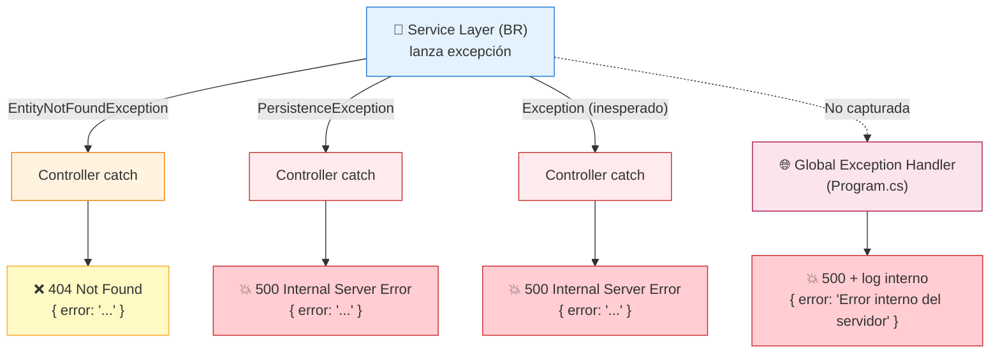

# Jerarquía de Excepciones

## Diagrama de Clases

```
System.Exception
└── Backend.Exceptions.PersistenceException
    └── (cualquier Exception no controlada wrappeada)

System.Exception
└── Backend.Exceptions.EntityNotFoundException
```

---

## PersistenceException

**Archivo**: `Exceptions/PersistenceException.cs`

```csharp
namespace Backend.Exceptions;

public class PersistenceException : Exception
{
    public PersistenceException(string message) : base(message) { }

    public PersistenceException(string message, Exception innerException)
        : base(message, innerException) { }
}
```

### Propósito
- **Wrapper** para errores de capa de datos (SQL, IO, JSON, etc.)
- **Abstrae** detalles de implementación (ADO.NET, EF, archivos JSON)
- **Convierte** excepciones técnicas en errores de negocio genéricos

### Cuándo Se Lanza

| Origen | Excepción Original | Wrappeada Como |
|--------|-------------------|----------------|
| `SqlClient` | `SqlException` (timeout, deadlock, constraint) | `PersistenceException` |
| `File IO` | `IOException` (JSON services legacy) | `PersistenceException` |
| `JSON` | `JsonException` (serialización) | `PersistenceException` |
| `BCrypt` | `SaltParseException` | `PersistenceException` |
| Genérico | `Exception` (inesperado) | `PersistenceException` |

### Patrón de Uso en Servicios

```csharp
try
{
    // Operación BD / IO
    var result = ExecuteQuery(sql, cmd => { ... });
    return result;
}
catch (PersistenceException)
{
    throw;  // Ya es PersistenceException, burbujea
}
catch (Exception ex) when (ex is not PersistenceException)
{
    throw new PersistenceException(
        $"Error al [operación] el [entidad] en SQL Server.", ex);
}
```

### Mensajes Típicos

```
"[Alumno] SQL error: SqlException — Violation of UNIQUE KEY constraint 'UQ__Alumnos__DNI...'."
"[Administrador] SQL error: SqlException — Execution Timeout Expired."
"Error al crear el alumno en SQL Server."
"El archivo 'data/alumnos.json' contiene JSON inválido."
```

---

## EntityNotFoundException

**Archivo**: `Exceptions/EntityNotFoundException.cs`

```csharp
namespace Backend.Exceptions;

public class EntityNotFoundException : Exception
{
    public EntityNotFoundException(string message) : base(message) { }

    public EntityNotFoundException(string entityName, int id)
        : base($"{entityName} con Id {id} no fue encontrado/a.") { }
}
```

### Propósito
- **404 semántico**: Recurso no existe
- **Mensaje consistente**: `"{Entidad} con Id {id} no fue encontrado/a."`
- **Tipado**: Permite `catch (EntityNotFoundException)` específico

### Cuándo Se Lanza

| Servicio | Método | Condición |
|----------|--------|-----------|
| `*SqlServerService` | `GetById(id)` | `ExecuteQuerySingle` retorna lista vacía |
| `*SqlServerService` | `Update(id, entity)` | `ExecuteNonQuery` retorna 0 rows affected |
| `*SqlServerService` | `Delete(id)` | `ExecuteNonQuery` retorna 0 rows affected |
| `AdminAuthService` | `LoginAsync` | No retorna `EntityNotFoundException` (retorna `null`) |

### Uso en Controllers

```csharp
[HttpGet("{id:int}")]
public IActionResult GetById(int id)
{
    try
    {
        return Ok(_service.GetById(id));
    }
    catch (EntityNotFoundException ex)
    {
        return NotFound(new { error = ex.Message });  // 404
    }
    catch (PersistenceException ex)
    {
        return StatusCode(500, new { error = ex.Message });  // 500
    }
}
```

---

## Flujo de Excepciones en Pipeline



---

## Manejo Global (Program.cs)

```csharp
app.UseExceptionHandler(errorApp =>
{
    errorApp.Run(async context =>
    {
        context.Response.StatusCode = 500;
        context.Response.ContentType = "application/json";
        var body = JsonSerializer.Serialize(new 
        { 
            error = "Ocurrió un error interno del servidor." 
        });
        await context.Response.WriteAsync(body);
    });
});
```

- Captura **excepciones no manejadas** en cualquier parte del pipeline
- **Nunca expone** stack traces ni detalles internos
- **Log interno** recomendado (Serilog, ILogger) antes de responder

---

## Mejores Prácticas

| ✅ Hacer | ❌ No Hacer |
|----------|-------------|
| `throw new PersistenceException("msg", ex)` preservar inner | `throw new PersistenceException(ex.Message)` perder stack trace |
| `catch (EntityNotFoundException) throw;` re-lanzar | `catch (Exception) return NotFound()` tragar excepción |
| Mensajes user-friendly en Exception.Message | Exponer SQL/connection strings en mensaje |
| `when (ex is not PersistenceException)` filtro | `catch (Exception ex) { throw new PersistenceException(ex.Message); }` |

---

## Testing de Excepciones

```csharp
// Test: EntityNotFoundException → 404
mockService.Setup(s => s.GetById(999))
    .Throws(new EntityNotFoundException("Alumno", 999));

var result = controller.GetById(999);
var notFound = Assert.IsType<NotFoundObjectResult>(result);
Assert.Equal("Alumno con Id 999 no fue encontrado/a.", 
    ((dynamic)notFound.Value).error);

// Test: PersistenceException → 500
mockService.Setup(s => s.GetAll())
    .Throws(new PersistenceException("DB timeout"));

var result2 = controller.GetAll();
var status500 = Assert.IsType<ObjectResult>(result2);
Assert.Equal(500, status500.StatusCode);
```