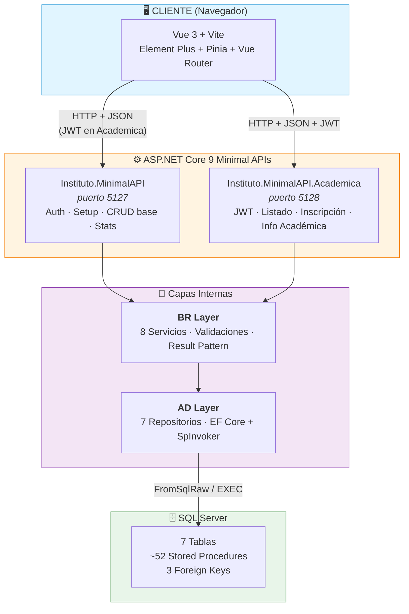
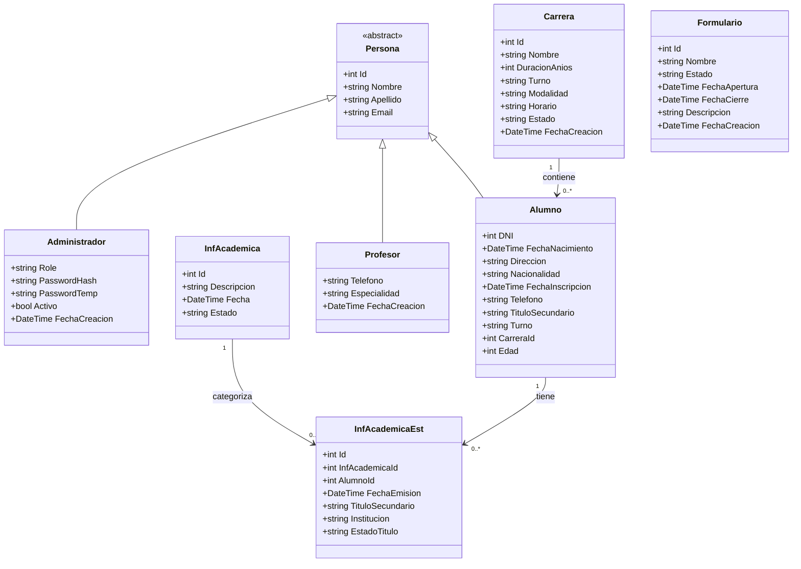
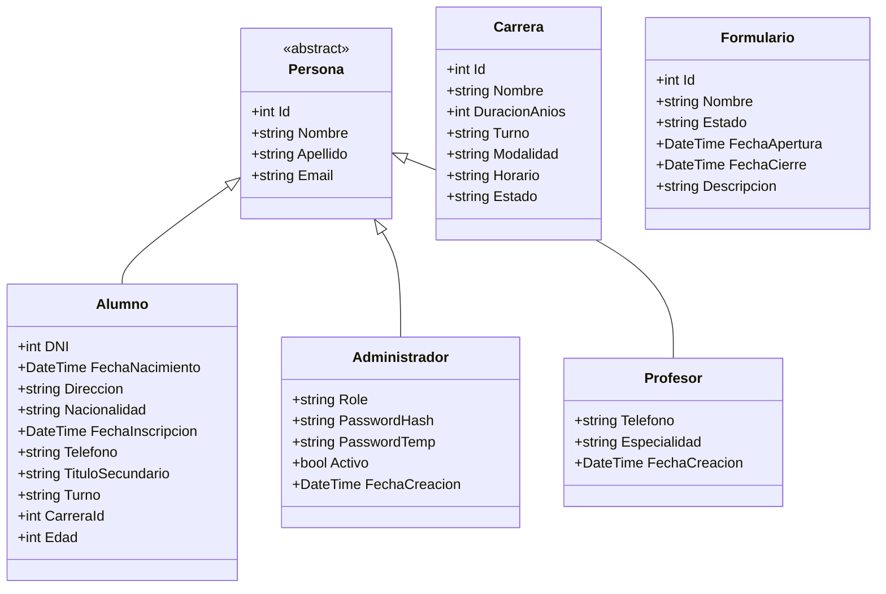
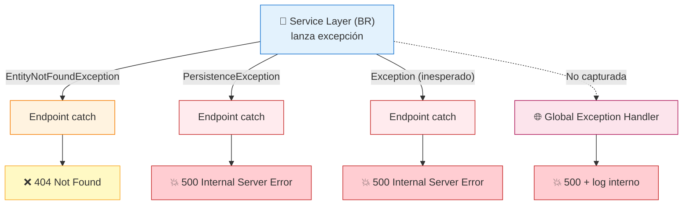
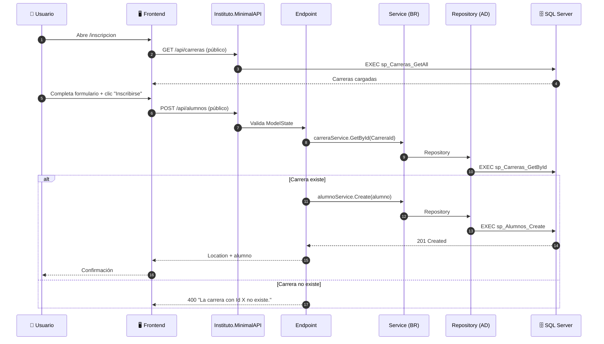
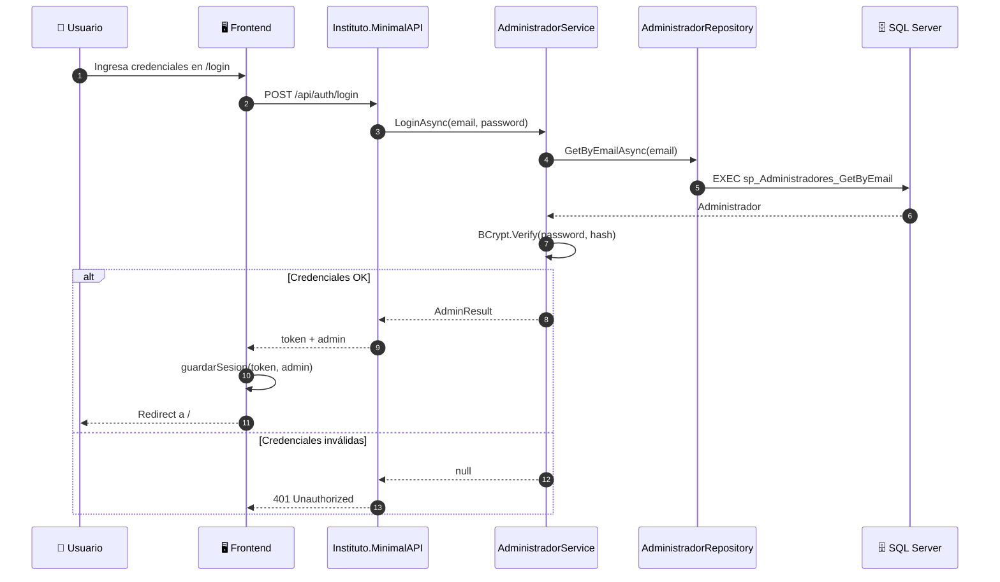
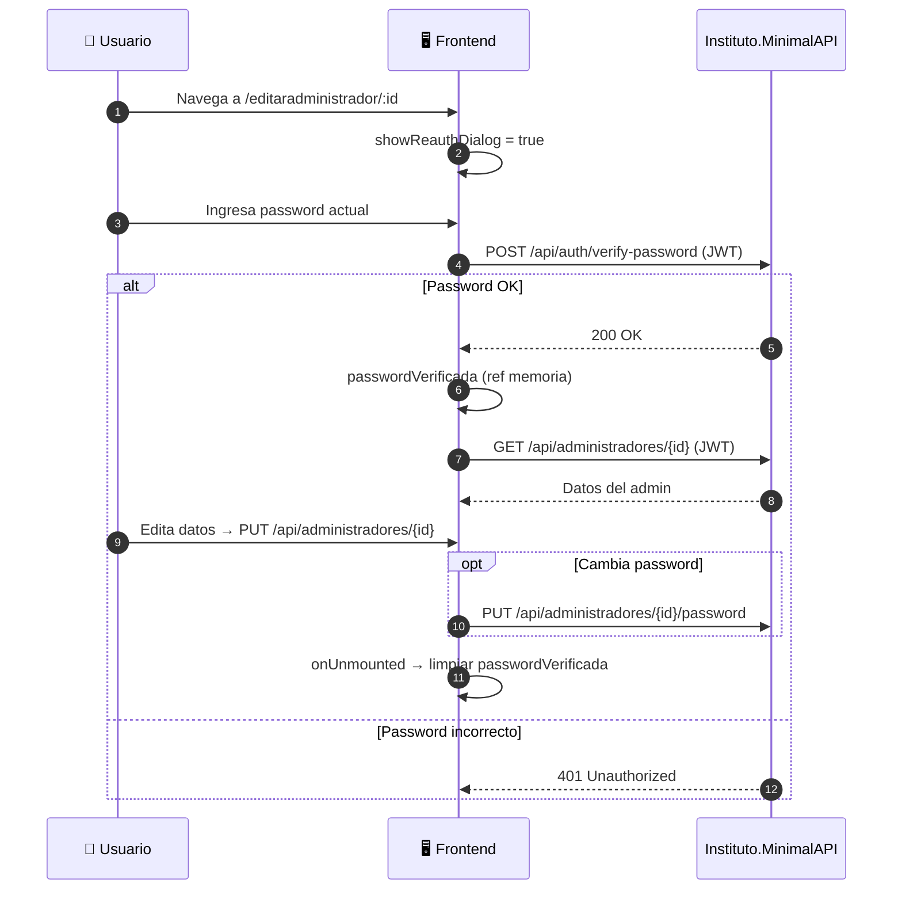

# Sistema de Gestión Institucional — Instituto Superior Docente Túpac Amaru

> Documento de referencia técnica para desarrollo y evolución del proyecto.
> Última actualización: 2026-10-03 | Versión: 1.2.0

---

## Índice

1. [Concepto del Sistema](#1-concepto-del-sistema)
2. [Arquitectura General](#2-arquitectura-general)
3. [Estructura de Directorios](#3-estructura-de-directorios)
4. [Back-end — ASP.NET Core 9 + SQL Server](#4-back-end--aspnet-core-9--sql-server)
5. [Front-end — Vue 3 + JavaScript + Vite](#5-front-end--vue-3--javascript--vite)
6. [Paradigma y Metodología de Desarrollo](#6-paradigma-y-metodología-de-desarrollo)
7. [Flujo de Datos](#7-flujo-de-datos)
8. [Requisitos Funcionales y Técnicos](#8-requisitos-funcionales-y-técnicos)
9. [Observaciones Técnicas y Deuda Técnica](#9-observaciones-técnicas-y-deuda-técnica)
10. [Hoja de Ruta — Próximos Pasos](#10-hoja-de-ruta--próximos-pasos)
11. [Historial de Versiones](#11-historial-de-versiones)

---

## 1. Concepto del Sistema

El sistema es una **plataforma de gestión académica** para el Instituto Superior Docente Túpac Amaru. Centraliza la administración de:

- **Carreras** — CRUD completo + validación de integridad (no eliminar si hay alumnos inscriptos).
- **Alumnos** — Inscripción pública (sin auth) + listado admin con join carrera.
- **Administradores** — CRUD autenticado con JWT + cambio de contraseña + re-autenticación.
- **Profesores** — CRUD completo autenticado (backend listo, frontend pendiente).
- **Formularios** — CRUD completo autenticado (estados: Borrador/Abierto/Cerrado).
- **Listados** — Vista consolidada alumnos + carrera (join en memoria).
- **Información Académica** — Catálogo de tipos + registros por alumno (Título, Título en trámite, Constancias).
- **Inscripción Pública** — Alumno + múltiples registros académicos en una transacción.
- **Autenticación** — Login JWT (8h expiración), BCrypt workFactor 12, Route Guards, Password toggle, Verify/Change password.

El sistema expone un **panel interno** accesible por personal administrativo (JWT) y un **formulario público de inscripción** para nuevos alumnos.

---

## 2. Arquitectura General (N-Tier: AD → BR → API)



**Capas del Backend (N-Tier):**
- **API Layer** (2 proyectos Minimal APIs):
  - `Instituto.MinimalAPI` — Auth, Setup, CRUD base (Carreras, Alumnos, Admin, Profesores, Formularios), Stats, Health
  - `Instituto.MinimalAPI.Academica` — JWT protegido, Listado, Inscripción pública, CRUD Info Académica
- **BR Layer** (`Instituto.BR`): 8 Servicios con lógica de negocio, validaciones centralizadas (`InfAcademicaValidator`), Result Pattern (`ServiceResult<T>`)
- **AD Layer** (`Instituto.AD`): 7 Repositorios tipados, **EF Core + Stored Procedures** (`SpInvoker` helpers), Entidades de dominio, `InstitutoDbContext`

**Patrones aplicados:**
- **Backend**: Repository pattern, **EF Core + SPs** (FromSqlRaw + ToListAsync), DI, Result Pattern (`ServiceResult<T>`), Global Exception Handling, **SpInvoker** helper centralizado
- **Frontend**: Composition API, Componentes por vista, CSS modular (BEM-like), Route Guards, Composable `useAuth`

---

## 3. Estructura de Directorios (Solution)

```
Instituto.sln
├── Instituto.AD/                    # Data Access Layer
│   ├── Data/                        # InstitutoDbContext (EF Core)
│   ├── Interfaces/                  # IRepository, IInfAcademicaRepositories
│   ├── Models/                      # Entidades: Persona, Administrador, Alumno, Carrera, Profesor, Formulario, InfAcademica, InfAcademicaEst, ListadoItem
│   ├── Repositories/                # 7 Repositorios (Patrón A: ADO.NET directo / Patrón B: SpInvoker)
│   ├── SpInvoker.cs                 # Helpers EF Core para SPs
│   └── Instituto.AD.csproj
│
├── Instituto.BR/                    # Business Rules Layer
│   ├── DTOs/                        # ServiceResult<T>, AdminResult, InscripcionDto, etc.
│   ├── Interfaces/                  # IServices, IInfAcademicaServices
│   ├── Services/                    # 8 Servicios: Carrera, Alumno, Administrador, Profesor, Formulario, Listado, InfAcademica, InfAcademicaEst, Inscripcion
│   ├── InfAcademicaConstants.cs     # Tipos, estados, catálogo
│   ├── InfAcademicaValidator.cs     # Validaciones centralizadas
│   └── Instituto.BR.csproj
│
├── Instituto.MinimalAPI/            # API Principal (sin JWT)
│   ├── Models/                      # ApiModels
│   ├── Program.cs                   # Composition root + DI + CORS
│   └── Instituto.MinimalAPI.csproj
│
├── Instituto.MinimalAPI.Academica/  # API Académica (con JWT)
│   ├── Endpoints/                   # 12 Endpoint classes
│   ├── ApiResults.cs                # Wrapper {isSuccess, message, data}
│   ├── Program.cs                   # JWT + AdminPolicy + DI académico
│   └── Instituto.MinimalAPI.Academica.csproj
│
├── Instituto.AD.Test/               # Tests repositorios (MSTest + Moq)
├── Instituto.BR.Test/               # Tests servicios (MSTest + Moq)
├── Instituto.MinimalAPI.Test/       # Tests integración API
│
├── Frontend/                        # Vue 3 + Vite
│   └── src/                         # 19 vistas, composables, components, router, CSS modular
│
└── Docs/                            # Documentación técnica completa
    ├── DATABASE/                    # 12 archivos modulares
    ├── DATABASE.md                  # Documento principal consolidado
    ├── sql/                         # sp_stored_procedures.sql, 04_InfAcademica.sql
    ├── backend/                     # Docs backend
    ├── frontend/                    # Docs frontend
    └── README.md                    # Índice documentación
```

> **Nota**: El script `CreateDatabase.sql` **no existe en el repositorio**. El DDL completo está documentado en `docs/backend/02-base-de-datos/02-script-creacion.md` y `docs/DATABASE.md`.

## Responsabilidades por Capa

### API Layer
- **Recibe** HTTP requests, valida `ModelState`
- **Delega** a servicios BR (no contienen lógica de negocio)
- **Maneja** excepciones de dominio → HTTP status codes
- **Retorna** `IResult`/`IActionResult` con JSON serializado (`ApiResponse<T>`)
- **Middleware**: JWT Auth, CORS, Global Exception Handler

### BR Layer (`Instituto.BR`)
- **Contiene** lógica de negocio y reglas de validación
- **Orquesta** validaciones cruzadas (ej. Alumno valida Carrera existe)
- **Ejecuta** operaciones via Repositories (AD)
- **Maneja** `ServiceResult<T>` pattern para éxito/fallo tipado
- **Servicios**: `CarreraService`, `AlumnoService`, `AdministradorService`, `ProfesorService`, `FormularioService`, `ListadoService`, `InfAcademicaService`, `InfAcademicaEstService`, `InscripcionService`

### AD Layer (`Instituto.AD`)
- **Repositorios** tipados por entidad (`ICarreraRepository`, `IAlumnoRepository`, etc.)
- **SpInvoker**: Helpers EF Core para invocar Stored Procedures
- **InstitutoDbContext**: EF Core DbContext con 7 DbSets
- **SQL**: Parameterizado, con SPs, sin reflexión
- **Entidades AD**: Separadas de BR/API

---

## Modelos de Dominio (AD Layer)



### DTOs (BR Layer)
- **Input**: `LoginDto`, `SetupAdminDto`, `ChangePasswordDto`, `VerifyPasswordDto`, `InscripcionDto`
- **Output**: `AdminResult` (record), `ServiceResult<T>`, `ServiceResult`, `AlumnoListadoDto`, `ListadoItem`

---

## Exceptions (Cross-Cutting)

| Excepción | HTTP Status | Uso |
|-----------|-------------|-----|
| `EntityNotFoundException` | 404 | Recurso no encontrado / inactivo |
| `PersistenceException` | 500 | Error BD / IO / Constraint violation |
| `UnauthorizedAccessException` | 401 | Credenciales inválidas / password incorrecto |

---

## Convenciones de Nombres (Actualizadas)

| Elemento | Convención | Ejemplo |
|----------|------------|---------|
| **Projects** | `Instituto.{Layer}` | `Instituto.AD`, `Instituto.BR`, `Instituto.MinimalAPI` |
| **Endpoints** | `{Entidad}Endpoints` | `AlumnosEndpoints`, `AuthEndpoints` |
| **Services** | `{Entidad}Service` | `AlumnoService`, `AdministradorService` |
| **Repositories** | `{Entidad}Repository` | `AlumnoRepository`, `CarreraRepository` |
| **Interfaces** | `I{Funcionalidad}` | `IAlumnoRepository`, `IAlumnoService` |
| **DTOs Input** | `{Accion}{Entidad}Dto` | `SetupAdminDto`, `LoginDto`, `ChangePasswordDto` |
| **DTOs Output** | `{Entidad}Result` / `{Entidad}Dto` | `AdminResult`, `AlumnoListadoDto`, `ServiceResult<T>` |
| **Exceptions** | `{Contexto}Exception` | `PersistenceException`, `EntityNotFoundException` |
| **Result Pattern** | `ServiceResult<T>` | `ServiceResult<Alumno>`, `ServiceResult` |
| **SQL Tables** | Plural PascalCase | `Administradores`, `Alumnos`, `Formularios` |
| **SQL Columns** | PascalCase | `Nombre`, `FechaNacimiento`, `PasswordHash` |
| **SQL Params** | `@NombreParametro` | `@Email`, `@Id`, `@PasswordHash` |

## 4. Back-end — ASP.NET Core 9 + SQL Server

### 4.1 Stack y Dependencias

| Paquete | Versión | Propósito |
|---------|---------|-----------|
| Microsoft.AspNetCore | 9.0 (SDK) | Framework web |
| Microsoft.AspNetCore.Authentication.JwtBearer | 9.0.5 | Autenticación JWT Bearer |
| Microsoft.AspNetCore.OpenApi | 9.0.5 | Generación de OpenAPI/Swagger |
| Microsoft.EntityFrameworkCore | 9.0.0 | ORM + FromSqlRaw |
| Microsoft.EntityFrameworkCore.SqlServer | 9.0.0 | Provider SQL Server |
| Microsoft.Data.SqlClient | 5.2.2 | Driver SQL Server (ADO.NET) |
| BCrypt.Net-Next | 4.0.3 | Hash de contraseñas |
| System.Text.Json | Built-in | Serialización |

**Target Framework**: net9.0  
**Características C#**: Nullable reference types, implicit usings.

---

### 4.2 Punto de Entrada: Instituto.MinimalAPI/Program.cs

```csharp
// CORS para el front-end Vue
builder.Services.AddCors(options =>
{
    options.AddPolicy("VueCors", policy =>
    {
        policy.AllowAnyOrigin().AllowAnyHeader().AllowAnyMethod();
    });
});

// JSON Options
builder.Services.ConfigureHttpJsonOptions(options =>
{
    options.SerializerOptions.PropertyNameCaseInsensitive = true;
    options.SerializerOptions.PropertyNamingPolicy = JsonNamingPolicy.CamelCase;
    options.SerializerOptions.Encoder = System.Text.Encodings.Web.JavaScriptEncoder.UnsafeRelaxedJsonEscaping;
});

// EF Core
var connectionString = builder.Configuration.GetConnectionString("SqlServer")
    ?? throw new InvalidOperationException("ConnectionStrings:SqlServer no configurado.");

builder.Services.AddDbContext<InstitutoDbContext>(options =>
    options.UseSqlServer(connectionString));

// Repositories (AD Layer)
builder.Services.AddScoped<ICarreraRepository, CarreraRepository>();
builder.Services.AddScoped<IAlumnoRepository, AlumnoRepository>();
builder.Services.AddScoped<IAdministradorRepository, AdministradorRepository>();
builder.Services.AddScoped<IProfesorRepository, ProfesorRepository>();
builder.Services.AddScoped<IFormularioRepository, FormularioRepository>();
builder.Services.AddScoped<IListadoRepository, ListadoRepository>();

// Services (BR Layer)
builder.Services.AddScoped<ICarreraService, CarreraService>();
builder.Services.AddScoped<IAlumnoService, AlumnoService>();
builder.Services.AddScoped<IAdministradorService, AdministradorService>();
builder.Services.AddScoped<IProfesorService, ProfesorService>();
builder.Services.AddScoped<IFormularioService, FormularioService>();
builder.Services.AddScoped<IListadoService, ListadoService>();

// Middleware global de errores
app.UseExceptionHandler(errorApp =>
{
    errorApp.Run(async context =>
    {
        context.Response.StatusCode = 500;
        context.Response.ContentType = "application/json";
        var body = JsonSerializer.Serialize(new { error = "Ocurrió un error interno del servidor." });
        await context.Response.WriteAsync(body);
    });
});

// Pipeline
app.UseRouting();
app.UseCors("VueCors");
app.MapGet("/", () => "Backend corriendo correctamente!");
app.Run();
```

**Puertos (launchSettings.json):**
- `Instituto.MinimalAPI`: HTTP `http://localhost:5127` | HTTPS `https://localhost:7244`
- `Instituto.MinimalAPI.Academica`: HTTP `http://localhost:5128`

---

### 4.3 Modelos y Jerarquía de Herencia



**Validaciones Data Annotations principales:**

| Entidad | Campo | Validación |
|---------|-------|-----------|
| Persona | Nombre, Apellido | `[Required]`, `[StringLength(100)]` |
| Persona | Email | `[Required]`, `[EmailAddress]`, `[StringLength(255)]` |
| Alumno | DNI | `[Required]`, `[Range(1000000, 99999999)]` |
| Alumno | CarreraId | `[Required]`, `[Range(1, int.MaxValue)]` |
| Alumno | Telefono | `[Phone]`, `[StringLength(50)]` |
| Administrador | Role | `[Required]`, `[StringLength(50)]` |
| Administrador | PasswordHash | `[Required]`, `[StringLength(255)]` |
| Carrera | DuracionAnios | `[Range(1, 10)]` |
| Carrera | Nombre | `[Required]`, `[StringLength(200)]` |
| Formulario | Nombre | `[Required]`, `[StringLength(200)]` |
| Formulario | Estado | `[Required]`, `[StringLength(20)]` |

---

### 4.4 Excepciones Personalizadas

Ubicadas en `Instituto.AD/Exceptions/`. Desacoplan el servicio de la lógica HTTP.

#### EntityNotFoundException

Lanzada cuando una entidad buscada por Id no existe (o está inactiva para Admin).

```csharp
public class EntityNotFoundException : Exception
{
    public EntityNotFoundException(string message) : base(message) { }
    public EntityNotFoundException(string entityName, int id)
        : base(entityName + " con Id " + id + " no fue encontrado/a.") { }
}
```

- **Se lanza en**: `GetById`, `Update`, `Delete`
- **Capturada en**: endpoints → 404 Not Found

#### PersistenceException

Lanzada ante cualquier error de BD (SqlException, timeout, constraint violation, etc.).

```csharp
public class PersistenceException : Exception
{
    public PersistenceException(string message) : base(message) { }
    public PersistenceException(string message, Exception inner) : base(message, inner) { }
}
```

- **Se lanza en**: operaciones ADO.NET / EF Core
- **Capturada en**: endpoints → 500 Internal Server Error

---

### 4.5 Data Transfer Objects (DTOs)

#### AdminResult (record inmutable)

```csharp
public record AdminResult(
    int    Id,
    string Nombre,
    string Apellido,
    string Email,
    string Role
);
```

- Sin `PasswordHash` → Nunca expone credenciales.
- Serializado directamente en JWT claims y response JSON.

#### AlumnoListadoDto

Proyección plana de un alumno con información de su carrera y su registro académico más relevante.

```csharp
public class AlumnoListadoDto
{
    public int AlumnoId { get; set; }
    public string NombreCompleto { get; set; }  // Apellido, Nombre
    public int DNI { get; set; }
    public string Email { get; set; }
    public string Carrera { get; set; }
    public string Turno { get; set; }
    public int Edad { get; set; }
    public string TipoAcademico { get; set; }
    public string EstadoTitulo { get; set; }
    public DateTime? FechaEmision { get; set; }
    public string TituloSecundario { get; set; }
}
```

**Otros DTOs:**
- `LoginDto` — email + password
- `SetupAdminDto` — nombre, apellido, email, password, role
- `ChangePasswordDto` — passwordActual, nuevaPassword
- `VerifyPasswordDto` — password
- `InscripcionDto` — alumno + informacionAcademica[]
- `ListadoItem` — Item para listados (AD layer)

---

### 4.6 Capa de Servicios (Business Rules Layer — Instituto.BR)

#### Registro en DI Container

```csharp
// Repositories (AD Layer)
builder.Services.AddScoped<ICarreraRepository, CarreraRepository>();
builder.Services.AddScoped<IAlumnoRepository, AlumnoRepository>();
builder.Services.AddScoped<IAdministradorRepository, AdministradorRepository>();
builder.Services.AddScoped<IProfesorRepository, ProfesorRepository>();
builder.Services.AddScoped<IFormularioRepository, FormularioRepository>();
builder.Services.AddScoped<IListadoRepository, ListadoRepository>();

// Services (BR Layer)
builder.Services.AddScoped<ICarreraService, CarreraService>();
builder.Services.AddScoped<IAlumnoService, AlumnoService>();
builder.Services.AddScoped<IAdministradorService, AdministradorService>();
builder.Services.AddScoped<IProfesorService, ProfesorService>();
builder.Services.AddScoped<IFormularioService, FormularioService>();
builder.Services.AddScoped<IListadoService, ListadoService>();
```

- **Scoped**: Una instancia por request HTTP
- **Interfaces**: Desacopla API de implementación concreta
- **Capas**: API → BR → AD (unidireccional)

---

#### SpInvoker (Data Access Layer - Instituto.AD)

Archivo: `Instituto.AD/SpInvoker.cs`

Helper reutilizable para invocar Stored Procedures desde EF Core:

| Método | Uso | Retorna |
|--------|-----|---------|
| `QueryEntityAsync<T>(sql, params)` | `FromSqlRaw` + `ToListAsync()` | `List<T>` |
| `ExistsAsync(sql, params)` | Ejecuta SP de `Exists` (1/0) | `bool` |
| `ScalarInsertAsync(sql, params)` | Abre conexión, `ExecuteScalarAsync()` | `int` |
| `NonQueryAsync(sql, params)` | `ExecuteSqlRawAsync` | `int` |

**Regla de oro**: Nunca usar `FirstOrDefaultAsync()` sobre `FromSqlRaw`/`SqlQueryRaw` con `EXEC` — siempre `ToListAsync()` + filtrado en memoria.

---

#### Repositorios (AD Layer)

Interfaces específicas por entidad (no genérica):

```csharp
public interface ICarreraRepository
{
    Task<List<Carrera>> GetAllAsync();
    Task<Carrera?> GetByIdAsync(int id);
    Task<Carrera> CreateAsync(Carrera entity);
    Task UpdateAsync(int id, Carrera entity);
    Task DeleteAsync(int id);
    Task<bool> ExistsAsync(int id);
}

public interface IAlumnoRepository
{
    Task<List<Alumno>> GetAllAsync();
    Task<Alumno?> GetByIdAsync(int id);
    Task<Alumno> CreateAsync(Alumno entity);
    Task UpdateAsync(int id, Alumno entity);
    Task DeleteAsync(int id);
    Task<bool> ExistsAsync(int id);
    Task<bool> ExistsByDNIAsync(int dni);
    Task<bool> ExistsByEmailAsync(string email);
    Task<bool> ExistsByCarreraIdAsync(int carreraId);
}
```

**Repositorios Implementados:**

| Repositorio | Entidad | Métodos Especiales |
|-------------|---------|-------------------|
| `CarreraRepository` | Carrera | `ExistsAsync` |
| `AlumnoRepository` | Alumno | `ExistsByDNIAsync`, `ExistsByEmailAsync`, `ExistsByCarreraIdAsync` |
| `AdministradorRepository` | Administrador | `GetByEmailAsync`, `ExistsByEmailAsync`, `CountAsync`, `UpdatePasswordHashAsync` |
| `ProfesorRepository` | Profesor | `ExistsByEmailAsync` |
| `FormularioRepository` | Formulario | `ExistsAsync` |
| `ListadoRepository` | ListadoItem (DTO) | `GetListadoAsync` (SP con joins) |
| `InfAcademicaRepository` | InfAcademica | CRUD catálogo |
| `InfAcademicaEstRepository` | InfAcademicaEst | `ExistsByCombination`, `ExistsByInfAcademica` |

---

### 4.7 Servicios CRUD (BR Layer)

#### Result Pattern

```csharp
public class ServiceResult
{
    public bool Success { get; set; }
    public string? Message { get; set; }
    
    public static ServiceResult Ok(string message = "Operación exitosa") => 
        new() { Success = true, Message = message };
    public static ServiceResult Fail(string message) => 
        new() { Success = false, Message = message };
}

public class ServiceResult<T>
{
    public bool Success { get; set; }
    public string? Message { get; set; }
    public T? Data { get; set; }
    
    public static ServiceResult<T> Ok(T data, string message = "Operación exitosa") => 
        new() { Success = true, Message = message, Data = data };
    public static ServiceResult<T> Fail(string message) => 
        new() { Success = false, Message = message };
}
```

**Servicios Implementados:**

| Servicio | Entidad | Validaciones Especiales |
|----------|---------|------------------------|
| `CarreraService` | Carrera | Duración 1-10 años, no eliminar si tiene alumnos |
| `AlumnoService` | Alumno | DNI/Email únicos, CarreraId existe |
| `AdministradorService` | Administrador | Email único, password ≥8 chars, BCrypt workFactor 12 |
| `ProfesorService` | Profesor | Email único |
| `FormularioService` | Formulario | Fechas válidas, estado válido, FechaCierre > FechaApertura |
| `ListadoService` | ListadoItem | Agrupa filas por alumno, prioridad de tipo académico |
| `InfAcademicaService` | InfAcademica | Descripción obligatoria ≤100, estado HABILITADO/DESHABILITADO |
| `InfAcademicaEstService` | InfAcademicaEst | Tipo existe, alumno existe, campos según tipo, sin duplicados |
| `InscripcionService` | Alumno + Info Académica | Transaccional (rollback si falla académica) |

**Ejemplo: `CarreraService.Delete` (validación cruzada):**

```csharp
public async Task<ServiceResult> DeleteAsync(int id)
{
    if (!await _repository.ExistsAsync(id))
        return ServiceResult.Fail($"La carrera con Id {id} no existe.");

    // Validación cruzada: no eliminar si tiene alumnos
    if (await _alumnoRepository.ExistsByCarreraIdAsync(id))
        return ServiceResult.Fail("No se puede eliminar la carrera porque tiene alumnos inscriptos.");

    await _repository.DeleteAsync(id);
    return ServiceResult.Ok("Carrera eliminada correctamente.");
}
```

---

### 4.8 AdministradorService (Autenticación + CRUD Completo)

**Archivo:** `Instituto.BR/Services/AdministradorService.cs`  
**Interface:** `IAdministradorService`

```csharp
public interface IAdministradorService
{
    Task<List<Administrador>> GetAllAsync();
    Task<Administrador?> GetByIdAsync(int id);
    Task<ServiceResult<Administrador>> CreateAsync(Administrador admin, string password);
    Task<ServiceResult<Administrador>> UpdateAsync(int id, Administrador admin);
    Task<ServiceResult> ChangePasswordAsync(int id, string passwordActual, string nuevaPassword);
    Task<ServiceResult> DeleteAsync(int id);
    Task<AdminResult?> LoginAsync(string email, string password);
    Task<bool> HayAdminsAsync();
    Task<AdminResult?> CrearPrimerAdminAsync(SetupAdminDto dto);
    Task<ServiceResult> ChangePasswordByEmailAsync(string email, string passwordActual, string nuevaPassword);
}
```

#### LoginAsync

```csharp
public async Task<AdminResult?> LoginAsync(string email, string password)
{
    var admin = await _repository.GetByEmailAsync(email);
    if (admin == null) return null;
    if (!BCryptNet.Verify(password, admin.PasswordHash)) return null;
    
    return new AdminResult(admin.Id, admin.Nombre, admin.Apellido, admin.Email, admin.Role);
}
```

- **Case-insensitive email**: `Trim().ToLower()` (normalizado en repositorio)
- **Solo activos**: Repositorio filtra `Activo = 1` en `GetByEmailAsync`
- **BCrypt verify**: Compara password plano vs hash almacenado

#### CreateAsync (con Password)

```csharp
public async Task<ServiceResult<Administrador>> CreateAsync(Administrador admin, string password)
{
    // Validaciones: Nombre, Apellido, Email obligatorios, password >= 8 chars
    admin.Email = admin.Email.ToLower().Trim();
    
    if (await _repository.ExistsByEmailAsync(admin.Email))
        return ServiceResult<Administrador>.Fail("Ya existe un administrador con ese email.");

    admin.PasswordHash = BCryptNet.HashPassword(password, workFactor: 12);
    admin.Activo = true;
    admin.FechaCreacion = DateTime.Now;

    try 
    { 
        var created = await _repository.CreateAsync(admin);
        return ServiceResult<Administrador>.Ok(created, "Administrador creado correctamente."); 
    }
    catch (SqlException ex) when (ex.Number == 2627 || ex.Number == 2601)
    { 
        return ServiceResult<Administrador>.Fail("Ya existe un administrador con ese email."); 
    }
}
```

#### ChangePasswordAsync / ChangePasswordByEmailAsync

Verifican `passwordActual` con `BCrypt.Verify`, hashean `nuevaPassword` (workFactor 12), actualizan via `UpdatePasswordHashAsync`.

---

### 4.9 Endpoints API

Todos los endpoints:
- Reciben servicios por DI.
- Validan `ModelState.IsValid` en POST/PUT (o manualmente).
- Retornan 201 Created (con Location header) en POST.
- Encapsulan en try-catch tipado: `EntityNotFoundException`→404, `PersistenceException`→500, `UnauthorizedAccessException`→401, `Exception`→500.
- `RequireAuthorization()` en grupos protegidos (excepto Auth, Setup, Carreras GET públicos).

#### MinimalAPI (puerto 5127)

| Módulo | Endpoints | Auth |
|--------|-----------|------|
| **Auth** | `POST /api/auth/login` | Público |
| | `POST /api/auth/verify-password` | JWT |
| **Setup** | `POST /api/setup/admin` (solo Dev) | Público |
| | `GET /api/setup/status` | Público |
| **Carreras** | `GET/POST/PUT/DELETE /api/carreras` | JWT (GET público) |
| **Alumnos** | `GET/PUT/DELETE /api/alumnos` | JWT |
| | `POST /api/alumnos` | Público |
| **Administradores** | `GET/POST/PUT/DELETE /api/administradores` | JWT |
| | `PUT /api/administradores/{id}/password` | JWT |
| **Profesores** | `GET/POST/PUT/DELETE /api/profesores` | JWT |
| **Formularios** | `GET/POST/PUT/DELETE /api/formularios` | JWT |
| **Listado (legacy)** | `GET /api/listado` | JWT |
| **Health/Stats** | `GET /health`, `GET /api/stats` | JWT |

#### MinimalAPI.Academica (puerto 5128) — JWT + AdminPolicy

| Módulo | Endpoints | Auth |
|--------|-----------|------|
| **Health** | `GET /health` | Público |
| **Listado** | `GET /api/listado` | JWT + AdminPolicy |
| **Inscripción** | `POST /api/inscripcion` | **Público** |
| **Catálogo** | `GET/POST/PUT/DELETE /api/inf-academica` | JWT + AdminPolicy |
| **Registros** | `GET/POST/PUT/DELETE /api/inf-academica-alumnos` | JWT + AdminPolicy |

---

### 4.10 Base de Datos

SQL Server (Express / LocalDB / SQL Auth)
Scripts DDL: `Docs/sql/sp_stored_procedures.sql` + `Docs/sql/04_InfAcademica.sql`

| Tabla | Columnas clave | Índices / Constraints |
|-------|----------------|----------------------|
| `Administradores` | Id, Nombre, Apellido, Email, PasswordHash, PasswordTemp, Role, Activo, FechaCreacion | PK Id, **UNIQUE parcial** Email (WHERE Activo=1) |
| `Carreras` | Id, Nombre, DuracionAnios, Turno, Modalidad, Horario, Estado, FechaCreacion | PK Id |
| `Alumnos` | Id, Nombre, Apellido, Email, DNI, FechaNacimiento, Direccion, Nacionalidad, FechaInscripcion, Telefono, TituloSecundario, Turno, CarreraId, FechaCreacion | PK Id, UNIQUE DNI, UNIQUE Email, FK CarreraId→Carreras |
| `Profesores` | Id, Nombre, Apellido, Email, Telefono, Especialidad, FechaCreacion | PK Id, UNIQUE Email |
| `Formularios` | Id, Nombre, Estado, FechaApertura, FechaCierre, Descripcion, FechaCreacion | PK Id |
| `Inf_Academica` | ID_Inf_Aca, Inf_Aca_Descripcion, Inf_Aca_Fecha, Inf_Aca_Estado | PK ID_Inf_Aca |
| `Inf_Academica_Est` | ID_Inf_Academica_Est, ID_Inf_Aca, ID_Est, Fecha_Emision, Titulo_Secundario, Institucion, Estado_Titulo | PK, UNIQUE (ID_Inf_Aca, ID_Est), FK a Inf_Academica y Alumnos (CASCADE) |

**Notas clave:**
- **Soft delete** en Administradores: `Activo=0` en lugar de DELETE físico
- **Índice UNIQUE parcial** permite reutilizar emails de admins inactivos
- **EF Core + SPs**: Todos los repositorios invocan SPs vía `SpInvoker`
- **Fix crítico**: Nunca `.FirstOrDefaultAsync()` sobre `EXEC` → `.ToListAsync()` + `.FirstOrDefault()`

---

### 4.11 Configuración

**appsettings.json (base - LocalDB / Windows Auth):**

```json
{
  "ConnectionStrings": {
    "SqlServer": "Server=(localdb)\\MSSQLLocalDB;Database=InstitutoDB;Trusted_Connection=True;TrustServerCertificate=True;"
  },
  "Jwt": {
    "Key": "REEMPLAZAR_CON_CLAVE_SECRETA_DE_AL_MENOS_32_CARACTERES",
    "Issuer": "InstitutoTupacAmaru",
    "Audience": "InstitutoTupacAmaruAdmin"
  },
  "Logging": { "LogLevel": { "Default": "Information", "Microsoft.AspNetCore": "Warning" } },
  "AllowedHosts": "*"
}
```

**appsettings.Development.json (SQL Auth - usado actualmente):**

```json
{
  "ConnectionStrings": {
    "SqlServer": "Server=localhost;Database=InstitutoDB;User Id=instituto_user;Password=Instituto2026;TrustServerCertificate=True;"
  },
  "Jwt": {
    "Key": "Tupac@Amaru#Instituto!JWT$2026*Clave&MuySecreta=32chars",
    "Issuer": "InstitutoTupacAmaru",
    "Audience": "InstitutoTupacAmaruAdmin"
  },
  "Logging": { "LogLevel": { "Default": "Information", "Microsoft.AspNetCore": "Warning" } }
}
```

> **Nota**: `appsettings.Development.json` está en el repo con credenciales de desarrollo. En producción usar variables de entorno / Key Vault.

## 5. Front-end — Vue 3 + JavaScript + Vite

### 5.1 Stack y Dependencias (Versiones Exactas)

#### Producción

| Paquete | Versión | Propósito |
|---------|---------|-----------|
| vue | **3.5.18** | Framework reactivo (Composition API) |
| vite | **7.0.6** | Bundler & Dev Server |
| vue-router | **4.5.1** | SPA Routing + Guards |
| pinia | **3.0.3** | Estado global |
| element-plus | **2.11.1** | Componentes UI |
| @element-plus/icons-vue | **1.1.4** | Iconografía |

#### Desarrollo

| Paquete | Versión | Propósito |
|---------|---------|-----------|
| eslint | **9.31.0** | Linting |
| prettier | **3.6.2** | Formato |
| @vitejs/plugin-vue | **6.0.1** | Plugin Vue para Vite |
| vite-plugin-vue-devtools | **8.0.0** | DevTools en desarrollo |

---

### 5.2 Configuración

**.env:**

```env
VITE_API_URL=http://localhost:5127
```

**vite.config.js**: alias `@` → `./src`, plugin Vue, devTools. **No hay proxy Vite configurado**.

No hay `tsconfig` (proyecto en JavaScript puro).

---

### 5.3 Inicialización: main.js

```javascript
import './assets/css/base/main.css'
import { createApp } from 'vue'
import { createPinia } from 'pinia'
import ElementPlus from 'element-plus'
import 'element-plus/dist/index.css'
import * as ElementPlusIconsVue from '@element-plus/icons-vue'
import App from './App.vue'
import router from './router'
import { setRouter } from '@/composables/useApiFetch'

const app = createApp(App)

app.use(createPinia())
app.use(router)
app.use(ElementPlus)

setRouter(router)

for (const [key, component] of Object.entries(ElementPlusIconsVue)) {
  app.component(key, component)
}

app.mount('#app')
```

---

### 5.4 Sistema de Rutas y Guards

**Archivo:** `src/router/index.js`

| Ruta | Nombre | Componente | Meta | Props |
|------|--------|------------|------|-------|
| / | home | HomeView | requiereAuth: true | - |
| /contacto | contacto | ContactoView | - | - |
| /inscripcion | inscripcion | InscripciónView | - | - |
| /login | login | LoginView | soloInvitado: true | - |
| /administracion | administracion | AdministradorView | requiereAuth: true | - |
| /agregaradministracion | agregaradministracion | AgregarAdministradorView | requiereAuth: true | - |
| /editaradministrador/:id | editaradministrador | EditarAdministradorView | requiereAuth: true | true |
| /eliminaradministrador/:id | eliminaradministrador | EliminarAdministradorView | requiereAuth: true | true |
| /carreras | carreras | CarreraView | requiereAuth: true | - |
| /agregarcarreras | agregarcarreras | AgregarCarreraView | requiereAuth: true | - |
| /editarcarrera/:id | editarcarrera | EditarCarreraView | requiereAuth: true | true |
| /eliminarcarreras/:id | eliminarcarreras | EliminarCarreraView | requiereAuth: true | true |
| /formularios | formularios | FormulariosView | requiereAuth: true | - |
| /agregarformulario | agregarformulario | AgregarFormularioView | requiereAuth: true | - |
| /editarformulario/:id | editarformulario | EditarFormularioView | requiereAuth: true | true |
| /eliminarformulario/:id | eliminarformulario | EliminarFormularioView | requiereAuth: true | true |
| /listados | listados | ListadoView | requiereAuth: true | - |
| * | not-found | NotFound | - | - |

**Guards globales (`router.beforeEach`):**

```javascript
router.beforeEach((to) => {
  const { isAuthenticated } = useAuth()
  const autenticado = isAuthenticated()

  if (to.meta.requiereAuth && !autenticado)
    return { name: 'login' }

  if (to.meta.soloInvitado && autenticado)
    return { name: 'home' }
})
```

---

### 5.5 Composable: useAuth.js

```javascript
const TOKEN_KEY = 'auth_token'
const ADMIN_KEY = 'auth_admin'

export function useAuth() {
  const getToken = () => {
    const token = sessionStorage.getItem(TOKEN_KEY)
    if (!token || token === 'undefined' || token === 'null' || token.length < 20) {
      return null
    }
    return token
  }

  const getAdmin = () => {
    const raw = sessionStorage.getItem(ADMIN_KEY)
    if (!raw || raw === 'undefined' || raw === 'null') return null
    try {
      return JSON.parse(raw)
    } catch {
      return null
    }
  }

  const isAuthenticated = () => !!getToken()

  const guardarSesion = (token, admin) => {
    if (!token || token === 'undefined' || token === 'null' || token.length < 20) {
      console.warn('[useAuth] Intentando guardar un token inválido:', token)
      return
    }
    sessionStorage.setItem(TOKEN_KEY, token)
    sessionStorage.setItem(ADMIN_KEY, JSON.stringify(admin))
  }

  const cerrarSesion = () => {
    sessionStorage.removeItem(TOKEN_KEY)
    sessionStorage.removeItem(ADMIN_KEY)
  }

  const authHeaders = () => {
    const token = getToken()
    return token
      ? { 'Content-Type': 'application/json', Authorization: `Bearer ${token}` }
      : { 'Content-Type': 'application/json' }
  }

  return { getToken, getAdmin, isAuthenticated, guardarSesion, cerrarSesion, authHeaders }
}
```

- Almacenamiento: `sessionStorage` (expira al cerrar pestaña).
- Logout: Limpia `sessionStorage` + redirect `/login`.
- Re-autenticación sensible: `EditarAdministradorView` exige password actual antes de cargar datos (POST `/api/auth/verify-password`), guarda password verificada en ref memoria (se limpia en `onUnmounted`).

---

### 5.6 Vistas por Módulo

#### Módulo Público

| Vista | Ruta | Descripción |
|-------|------|-------------|
| HomeView | / | Dashboard admin (cards menú) |
| ContactoView | /contacto | Info contacto estática |
| FormulariosView | /formularios | Tabla formularios + CRUD |
| AgregarFormularioView | /agregarformulario | Formulario crear |
| EditarFormularioView | /editarformulario/:id | Formulario editar |
| EliminarFormularioView | /eliminarformulario/:id | Confirmar eliminar |

#### Módulo Auth

| Vista | Ruta | Descripción |
|-------|------|-------------|
| LoginView | /login | Login JWT + toggle password (View/Hide icons) |

#### Módulo Administradores

| Vista | Ruta | Descripción |
|-------|------|-------------|
| AdministradorView | /administracion | Listado tabla (Nombre, Apellido, Email, Acciones) |
| AgregarAdministradorView | /agregaradministracion | Formulario crear |
| EditarAdministradorView | /editaradministrador/:id | Re-auth modal → carga datos → PUT datos + opcional PUT password |
| EliminarAdministradorView | /eliminaradministrador/:id | Confirmar + DELETE |

#### Módulo Carreras

| Vista | Ruta | Descripción |
|-------|------|-------------|
| CarreraView | /carreras | Listado tabla |
| AgregarCarreraView | /agregarcarreras | Formulario crear |
| EditarCarreraView | /editarcarrera/:id | Formulario editar |
| EliminarCarreraView | /eliminarcarreras/:id | Confirmar + DELETE (error si hay alumnos) |

#### Módulo Listados

| Vista | Ruta | Descripción |
|-------|------|-------------|
| ListadoView | /listados | Tabla Alumno + Carrera + Info Académica (`table-cols-listado`) |
| InscripciónView | /inscripcion | Público — Formulario extenso + POST `/api/inscripcion` |

> **Total: 19 vistas** (1 Auth + 1 Dashboard + 4 Administradores + 4 Carreras + 4 Formularios + 1 Listado + 1 Inscripción + 1 Contacto + 1 404)

> **Nota**: Profesores tiene backend CRUD completo ✅ pero **Frontend sin vistas** ❌

---

### 5.7 Estilos CSS (Modular, sin `<style>` en .vue)

```
src/assets/css/
├── base/
│   ├── main.css        # @import de todo
│   └── global.css      # Variables CSS, reset, utilidades
├── components/
│   ├── buttons.css     # .btn, variants, sizes
│   ├── card.css        # .card, .card-center, .card-lg, .card-header, .card-title
│   ├── forms.css       # .form, .form-row, .field, .form-actions
│   ├── innputs.css     # Inputs, selects, .password-field, .password-toggle
│   ├── table.css       # .table, .table-header, .table-row, .table-cols-listado, badges
│   ├── navbar.css      # .navbar, .menu
│   └── admin-menu.css  # Grid botones dashboard
└── layout/
    └── section.css     # .section (centrado + padding)
```

**Principio:** Las vistas solo usan clases globales. Variables en `global.css` (single source of truth).
*Nota: El archivo actual se llama `innputs.css` (typo conocido, ver deuda técnica)*

---

### 5.8 Integración con la API

Base URL: `import.meta.env.VITE_API_URL` (configurado en `.env`)

Headers: `useAuth().authHeaders()` → Bearer token automático.

Patrón estándar:

```javascript
const API = import.meta.env.VITE_API_URL
const { authHeaders } = useAuth()

const res = await fetch(`${API}/api/administradores`, { headers: authHeaders() })
if (!res.ok) throw new Error(`HTTP ${res.status}`)
const data = await res.json()
```

Endpoints consumidos por módulo: ver `Docs/frontend/10-frontend/06-integracion-api.md` para tabla completa.

---

### 5.9 Configuración y Build

**Scripts disponibles:**

```bash
npm run dev        # Servidor desarrollo (Vite)
npm run build      # Build producción (vite build)
npm run preview    # Preview build
npm run lint       # ESLint + fix
npm run format     # Prettier
```

---

## 6. Paradigma y Metodología de Desarrollo

### 6.1 Paradigma: Programación Orientada a Objetos (POO)

#### Encapsulamiento
- `SpInvoker` encapsula EF Core + invocación de Stored Procedures.
- `InstitutoDbContext` encapsula la configuración de EF Core y mapeo.

#### Herencia
- `Persona` abstracta concentra propiedades comunes + validaciones.
- `Alumno`, `Administrador`, `Profesor` heredan y añaden campos específicos.

#### Polimorfismo
- Interfaces específicas (`ICarreraRepository`, `IAlumnoRepository`, etc.) permiten DI tipada por entidad.
- Servicios dependen de abstracción (`IServicio`), no implementación concreta.

---

### 6.2 Patrones Utilizados

| Patrón | Aplicación |
|--------|------------|
| **Repository** | Interfaces específicas por entidad + implementaciones tipadas |
| **Template Method** | `SpInvoker` define esqueleto para invocar SPs (`QueryEntityAsync`, `ScalarInsertAsync`, etc.) |
| **DTO** | `AdminResult`, `AlumnoListadoDto` desacoplan representación de dominio |
| **Scoped DI** | Servicios por request (thread-safe) |
| **Separación de capas** | Endpoints / Services / Models / DTOs / Exceptions |
| **Inyección de dependencias** | Constructores, no `new` directo |
| **Result Pattern** | `ServiceResult<T>` para éxito/fallo tipado |

---

### 6.3 Manejo de Errores — Estrategia por Capas



**Principios:**
- Ningún stack trace llega al cliente.
- Respuestas error siempre JSON: `{ "error": "..." }`.
- Middleware global `UseExceptionHandler` = red de seguridad final.
- Endpoints 401/403 devuelven JSON (configurado en `JwtBearerEvents`).

---

### 6.4 Convenciones de Código

| Convención | Detalle |
|------------|---------|
| **Validación declarativa** | Data Annotations en modelos (`[Required]`, `[Range]`, `[EmailAddress]`, `[Phone]`, `[StringLength]`) |
| **Validación imperativa** | Validaciones en servicios BR |
| **Respuestas HTTP semánticas** | `200`, `201` (Location), `204`, `400`, `401`, `403`, `404`, `500` |
| **No exposición de internos** | `catch (Exception)` → mensaje controlado, nunca stack trace |
| **Null safety** | Propiedades requeridas `= string.Empty`; `?` solo donde opcional |
| **Consistencia Id en PUT** | `id` de ruta usado, no del body |
| **Work factor BCrypt** | 12 (configurado en `AdministradorService`) |

---

## 7. Flujo de Datos

### Flujo: Inscripción Pública de Alumno



### Flujo: Login + Acceso Panel



### Flujo: Edición de Administrador con Re-autenticación



---

## 8. Requisitos Funcionales y Técnicos

### 8.1 Requisitos Funcionales

| ID | Módulo | Requisito | Estado |
|----|--------|-----------|--------|
| RF-01 | Carreras | CRUD completo + validación integridad | ✅ |
| RF-02 | Alumnos | Inscripción pública + listado admin con join | ✅ |
| RF-03 | Administradores | CRUD autenticado + change password + re-auth | ✅ |
| RF-04 | Profesores | CRUD completo autenticado (backend) | ✅ Backend / ❌ Frontend |
| RF-05 | Formularios | CRUD completo autenticado (estados) | ✅ |
| RF-06 | Listados | Vista consolidada alumnos + carrera + info académica | ✅ |
| RF-07 | Auth | Login JWT (8h) + BCrypt 12 | ✅ |
| RF-08 | Auth | Route Guards + sessionStorage | ✅ |
| RF-09 | Auth | Verify/Change password | ✅ |
| RF-10 | Setup | Primer admin solo Dev (1 vez) | ✅ |
| RF-11 | Info Académica | Catálogo + registros por alumno + prioridad | ✅ |
| RF-12 | Inscripción Pública | Alumno + múltiples registros académicos transaccional | ✅ |

### 8.2 Requisitos Técnicos — Back-end
- .NET 9 SDK
- SQL Server (Express / LocalDB / Docker)
- EF Core 9 + SPs vía SpInvoker
- JWT (solo en MinimalAPI.Academica)
- CORS AllowAnyOrigin (solo dev)

### 8.3 Requisitos Técnicos — Front-end
- Node.js 20.19.0+ / 22.12.0+ (según `package.json` engines)
- npm 10+ (incluido en Node)
- `npm install` en `Frontend/`
- `npm run dev` → `http://localhost:5176`
- Backend en `http://localhost:5127` (y opcional `5128`)

### 8.4 Comandos de Inicio

```bash
# 1. Base de Datos (SQL Server)
# Opción A: SQL Server Express / Developer Edition
#   Conectar con SSMS / Azure Data Studio / VS Code
#   Ejecutar en orden:
#   1. DDL base (ver Docs/DATABASE.md §7.1)
#   2. Docs/sql/sp_stored_procedures.sql
#   3. Docs/sql/04_InfAcademica.sql
#
# Opción B: LocalDB (desarrollo)
#   Se crea automáticamente al ejecutar la API con appsettings.json

# 2. Back-end (API Principal)
cd Instituto.MinimalAPI
dotnet run --environment Development
# → http://localhost:5127

# 3. Back-end (API Académica, opcional)
cd Instituto.MinimalAPI.Academica
dotnet user-secrets set "Jwt:Key" "una-clave-de-desarrollo-de-al-menos-32-caracteres"
dotnet run --environment Development
# → http://localhost:5128

# 4. Front-end (otra terminal)
cd Frontend
npm install    # solo primera vez
npm run dev
# → http://localhost:5176

# 5. Crear primer admin (una sola vez, solo Development)
curl -X POST http://localhost:5127/api/setup/admin \
  -H "Content-Type: application/json" \
  -d '{"nombre":"Super","apellido":"Admin","email":"admin@tupac.edu.ar","password":"Tupac123","role":"SuperAdmin"}'

# 6. Login
# Abrir http://localhost:5176/login con: admin@tupac.edu.ar / Tupac123
```

---

## 9. Observaciones Técnicas y Deuda Técnica

### Bugs Críticos Activos

| Ubicación | Problema | Severidad |
|-----------|----------|-----------|
| `InscripciónView.vue` | `CarreraId: string` vs `number` (backend) → 400 potencial | Crítica |

### Deuda Técnica — Back-end

| Item | Prioridad | Estado |
|------|-----------|--------|
| Sin DTO para GET administradores (expone `PasswordHash`, `Role`) | Alta | ❌ |
| `ex.Message.Contains("Carrera")` frágil en endpoints | Media | ❌ |
| Sin rate limiting | Alta | ❌ |
| Sin paginación en GET All | Media | ❌ |
| Sin Swagger/OpenAPI | Media | ❌ |
| Profesores: Backend completo pero Frontend sin vistas | Media | ❌ |

### Deuda Técnica — Front-end

| Item | Prioridad | Estado |
|------|-----------|--------|
| Sin capa de servicios API centralizada (`src/services/`) | Alta | ❌ |
| Nombre archivo `InscripciónView.vue` con `ó` (riesgo Linux/CI) | Media | ❌ |
| Typo `innputs.css` → `inputs.css` (archivo real: `innputs.css`) | Baja | ❌ |

### Fortalezas del Diseño Actual

- Herencia `Persona` elimina duplicación en 3 entidades.
- `SpInvoker` centraliza la invocación de Stored Procedures desde EF Core.
- Separación clara: Endpoints / Services / Models / DTOs / Exceptions.
- Data Annotations centralizan validaciones en modelo.
- Excepciones tipadas → mapeo HTTP limpio sin acoplamiento.
- JWT stateless + BCrypt 12 + claims estándar.
- Frontend: Composition API, CSS modular, Route Guards, `useAuth` composable.
- `EditarAdministradorView`: re-autenticación segura + password en memoria.
- Módulo académico con transaccionalidad (rollback si falla).
- Repositorios con `ToListAsync()` + `FirstOrDefault()` (patrón correcto para SPs).

---

## 10. Hoja de Ruta — Próximos Pasos

### Completado (v1.2.0)

- [x] Arquitectura N-Tier con EF Core + Stored Procedures
- [x] 2 Minimal APIs (5127 principal + 5128 académica con JWT)
- [x] 8 Servicios CRUD + Auth integrada en `AdministradorService`
- [x] Excepciones tipadas + middleware global
- [x] Route Guards + sessionStorage + re-auth modal
- [x] CSS modular sin `<style>` en componentes
- [x] Documentación modular en `Docs/`
- [x] Soft delete en Administradores con índice UNIQUE parcial
- [x] Response wrapper `ApiResponse<T>` + camelCase JSON
- [x] **Módulo Información Académica** (catálogo + registros + inscripción transaccional)
- [x] **SpInvoker** helper para SPs desde EF Core
- [x] Fixes de compatibilidad EF Core + SPs (`ToListAsync` sobre `EXEC`)

### Prioridad Crítica

- [ ] Corregir `CarreraId: string` → `number` en `InscripciónView.vue`
- [ ] Crear vistas de Profesores (Frontend)

### Prioridad Alta

- [ ] Capa de servicios API centralizada (`src/services/`)
- [ ] DTO para administradores (no exponer `PasswordHash`/`Role` en GET)
- [ ] Rate limiting
- [ ] Paginación en listados
- [ ] Swagger/OpenAPI en ambas APIs

### Prioridad Media

- [ ] Renombrar `InscripciónView.vue` → `InscripcionView.vue`
- [ ] Renombrar `innputs.css` → `inputs.css`
- [ ] Validación `FechaCierre > FechaApertura` en backend (Formularios)

### Prioridad Baja

- [ ] Auditoría login (IP, user-agent, timestamp)
- [ ] Refresh tokens + revocación
- [ ] 2FA (TOTP)
- [ ] Policy-based authorization (SuperAdmin vs Admin)

---

## 11. Historial de Versiones

| Versión | Fecha | Cambios Principales |
|---------|-------|---------------------|
| **1.2.0** | 2026-10-03 | **Módulo Información Académica**: 2 tablas nuevas, 14 SPs, `sp_Listado_GetAll` reescrito, `SpInvoker` helper, 2ª Minimal API (puerto 5128). Documentación migrada a diagramas Mermaid. |
| **1.1.0** | 2026-09-28 | DDL real en docs, SQL Auth + LocalDB, soft delete con UNIQUE parcial, `Login` sync, `ApiResponse<T>` wrapper, camelCase JSON, `DATABASE.md` snapshot, puertos 5127/5176. |
| 1.0.0 | 2026-09-27 | Migración completa a SQL Server + JWT: arquitectura N-Tier (AD/BR/API), 8 controllers, 6 servicios CRUD, AuthService, excepciones tipadas. |
| 0.1.1 | 2026-04-15 | Corrección typo Roll→Role, 201 Created en POSTs, validación CarreraId, Data Annotations. |
| 0.1.0 | 2026-03-01 | Backend JSON files, herencia Persona, 4 controladores, frontend Vue 3 + Element Plus básico. |

---

*Documento mantenido por el equipo de desarrollo — Instituto Superior Docente Túpac Amaru (2026)*