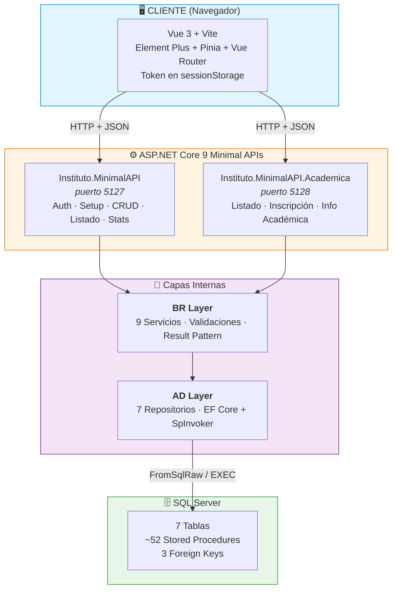

# 🏛️ Sistema de Gestión Institucional — Instituto Superior Docente Túpac Amaru

> Plataforma de gestión académica para la administración de carreras, alumnos, administradores, profesores, formularios, **información académica e inscripciones**. Desarrollada con arquitectura **Frontend (Vue 3) + Backend (ASP.NET Core 9 Minimal APIs + EF Core + SQL Server)** en arquitectura **N-Tier (AD → BR → API)**.

---

## 📋 Descripción del Proyecto

Sistema web para el **Instituto Superior Docente Túpac Amaru** que centraliza la gestión académica y administrativa:

| Módulo | Funcionalidad | Estado Backend | Estado Frontend |
|--------|---------------|----------------|-----------------|
| **Carreras** | CRUD completo + validación integridad (no eliminar si hay alumnos) | ✅ | ✅ |
| **Alumnos** | Inscripción pública + listado con join carrera | ✅ | ✅ (inscripción) /(panel admin sin Edit/Delete) |
| **Administradores** | CRUD + change-password + verify-password + login | ✅ | ✅ |
| **Profesores** | CRUD completo | ✅ | ❌ (sin vistas) |
| **Formularios** | CRUD completo (estados: Borrador/Abierto/Cerrado) | ✅ | ✅ (UI completa) |
| **Listados** | Vista consolidada alumnos + carrera + **info académica** (join SP + procesamiento BR) | ✅ | ✅ |
| **Información Académica** | Catálogo tipos (Título, Título en trámite, Constancias) + registros por alumno | ✅ | ⚠️ (solo listado/admin) |
| **Inscripción Pública** | Alumno + múltiples registros académicos en una transacción | ✅ | ✅ |
| **Autenticación** | Login (email+password+BCrypt) + token de sesión GUID en `sessionStorage` + Route Guards | ✅ | ✅ |

---



**Capas del Backend:**
- **API Layer** (2 proyectos Minimal APIs):
  - `Instituto.MinimalAPI` — Auth, Setup, CRUD base (Carreras, Alumnos, Admin, Profesores, Formularios), Listado, Stats, Health
  - `Instituto.MinimalAPI.Academica` — Listado consolidado, Inscripción pública, CRUD Info Académica (catálogo + registros por alumno)
- **BR Layer** (`Instituto.BR`): 9 Servicios con lógica de negocio, validaciones centralizadas (`InfAcademicaValidator`), Result Pattern (`ServiceResult<T>`)
- **AD Layer** (`Instituto.AD`): 7 Repositorios tipados, **EF Core + Stored Procedures** (`SpInvoker` helpers), Entidades de dominio, `InstitutoDbContext`

**Patrones aplicados:**
- **Backend**: Repository pattern, **EF Core + SPs** (FromSqlRaw + ToListAsync), DI, Result Pattern (`ServiceResult<T>`), Global Exception Handling, **SpInvoker** helper centralizado
- **Frontend**: Composition API, Componentes por vista, CSS modular (BEM-like), Route Guards (client-side), Composable `useAuth`

---

## 🛠️ Stack Tecnológico

### Frontend
| Tecnología | Versión | Uso |
|------------|---------|-----|
| Vue 3 | 3.5.18 | Framework reactivo (Composition API) |
| JavaScript | ES2023+ | Lógica de aplicación (sin TypeScript) |
| Vite | 7.0.6 | Bundler & Dev Server |
| Vue Router | 4.5.1 | SPA Routing + Guards |
| Pinia | 3.0.3 | Estado global (auth vía `useAuth` composable + sessionStorage) |
| Element Plus | 2.11.1 | Componentes UI |
| @element-plus/icons-vue | 1.1.4 | Iconografía |
| ESLint + Prettier | 9.31 / 3.6.2 | Linting & Formato |

### Backend
| Tecnología | Versión | Uso |
|------------|---------|-----|
| ASP.NET Core | 9.0 | Minimal APIs Framework |
| Entity Framework Core | 9.0 | ORM + FromSqlRaw para SPs |
| Microsoft.Data.SqlClient | 5.2+ | Driver SQL Server (ADO.NET) |
| BCrypt.Net-Next | 4.0.3 | Hash de contraseñas (workFactor: 12) |
| System.Text.Json | Built-in | Serialización |
| MSTest + Moq | 3.6+ / 4.20+ | Testing unitario e integración |

### Base de Datos
- **SQL Server** (Express / LocalDB / SQL Auth)
- **7 Tablas**: `Administradores`, `Alumnos`, `Carreras`, `Profesores`, `Formularios`, `Inf_Academica`, `Inf_Academica_Est`
- **3 FKs**: Alumnos→Carreras, Inf_Academica_Est→Inf_Academica, Inf_Academica_Est→Alumnos (CASCADE)
- **~52 Stored Procedures** (CRUD base + académicas + `sp_Listado_GetAll` reescrito)
- **Índices UNIQUE**: 12 (incluye 1 parcial `UQ_Administradores_Email_Activo`)
- Connection Strings configurables en `appsettings.json` / `appsettings.Development.json`
- Scripts DDL en `Docs/sql/` + documentación completa en `Docs/DATABASE/`

---

## 📁 Estructura del Proyecto (Solution)

```
Instituto.sln
├── Instituto.AD/                    # Data Access Layer
│   ├── Data/                        # InstitutoDbContext (EF Core)
│   ├── Interfaces/                  # IRepository, IInfAcademicaRepositories
│   ├── Models/                      # Entidades: Persona, Administrador, Alumno, Carrera, Profesor, Formulario, InfAcademica, InfAcademicaEst, ListadoItem
│   ├── Repositories/                # 7 Repositorios
│   ├── SpInvoker.cs                 # Helpers EF Core para SPs
│   └── Instituto.AD.csproj
│
├── Instituto.BR/                    # Business Rules Layer
│   ├── DTOs/                        # ServiceResult<T>, AdminResult, InscripcionDto, AlumnoListadoDto, etc.
│   ├── Interfaces/                  # IServices, IInfAcademicaServices
│   ├── Services/                    # 9 Servicios: Carrera, Alumno, Administrador, Profesor, Formulario, Listado, InfAcademica, InfAcademicaEst, Inscripcion
│   ├── InfAcademicaConstants.cs     # Tipos, estados, catálogo
│   ├── InfAcademicaValidator.cs     # Validaciones centralizadas
│   └── Instituto.BR.csproj
│
├── Instituto.MinimalAPI/            # API Principal
│   ├── Endpoints/                   # Extension methods por dominio
│   │   ├── AuthEndpoints.cs
│   │   ├── SetupEndpoints.cs
│   │   ├── AdminEndpoints.cs
│   │   ├── AlumnoEndpoints.cs
│   │   ├── CarreraEndpoints.cs
│   │   ├── ProfesorEndpoints.cs
│   │   ├── FormularioEndpoints.cs
│   │   ├── ListadoEndpoints.cs
│   │   ├── HealthEndpoints.cs
│   │   └── DebugEndpoints.cs
│   ├── Models/                      # ApiModels (LoginRequest, AdminCreateDto, etc.)
│   ├── Program.cs                   # Composition root + DI + CORS + Global Exception Handler
│   ├── appsettings.Development.json # ConnectionString (SQL Auth)
│   ├── appsettings.json             # ConnectionString (LocalDB)
│   └── Instituto.MinimalAPI.csproj
│
├── Instituto.MinimalAPI.Academica/  # API Académica
│   ├── Endpoints/                   # 12 Endpoint classes
│   ├── ApiResults.cs                # Wrapper {isSuccess, message, data}
│   ├── Program.cs                   # DI académico + Swagger
│   └── Instituto.MinimalAPI.Academica.csproj
│
├── Instituto.AD.Test/               # Tests repositorios (MSTest + Moq)
├── Instituto.BR.Test/               # Tests servicios (MSTest + Moq)
├── Instituto.MinimalAPI.Test/       # Tests integración API
│
├── Frontend/                        # Vue 3 + Vite
│   ├── package.json
│   ├── vite.config.js
│   ├── .env                         # VITE_API_URL=http://localhost:5127
│   └── src/
│       ├── components/              # NavBar, Banner
│       ├── composables/             # useAuth, useApiFetch
│       ├── router/                  # Vue Router + guards
│       ├── services/
│       │   └── api/                 # Servicios API por dominio
│       │       ├── adminApi.js
│       │       ├── alumnoApi.js
│       │       ├── carreraApi.js
│       │       ├── profesorApi.js
│       │       ├── formularioApi.js
│       │       ├── listadoApi.js
│       │       ├── authApi.js
│       │       ├── statsApi.js
│       │       └── index.js
│       ├── views/                   # 19 vistas por módulo
│       └── assets/css/              # CSS modular
│
└── Docs/                            # Documentación técnica completa
    ├── DATABASE/                    # 12 archivos modulares
    ├── DATABASE.md                  # Documento principal consolidado
    ├── sql/                         # sp_stored_procedures.sql, 04_InfAcademica.sql
    ├── backend/                     # Docs backend
    ├── frontend/                    # Docs frontend
    └── README.md                    # Índice documentación
```

---

## 🚀 Inicio Rápido

### Prerrequisitos
- **.NET 9 SDK**
- **Node.js 20+** y **npm**
- **SQL Server** (Express, LocalDB, o contenedor Docker)

### 1. Base de Datos (SQL Server)
```bash
# Opción A: SQL Server Express / Developer Edition
# Conectar con SSMS / Azure Data Studio / VS Code
# Ejecutar en orden:
# 1. DDL base (ver Docs/DATABASE.md §7.1)
# 2. Docs/sql/sp_stored_procedures.sql
# 3. Docs/sql/04_InfAcademica.sql

# Opción B: LocalDB (desarrollo)
# Se crea automáticamente al ejecutar la API con appsettings.json
```

### 2. Configuración Backend
```json
// Instituto.MinimalAPI/appsettings.Development.json (desarrollo con SQL Auth)
{
  "ConnectionStrings": {
    "SqlServer": "Server=localhost;Database=InstitutoDB;User Id=instituto_user;Password=Instituto2026;TrustServerCertificate=True;"
  },
  "Cors": {
    "AllowedOrigins": ["http://localhost:5176"]
  }
}
```

### 3. Ejecutar Backend (2 APIs)
```bash
# Terminal 1: API Principal (puerto 5127)
cd Instituto.MinimalAPI
dotnet run --environment Development
# → http://localhost:5127

# Terminal 2: API Académica (puerto 5128) - opcional
cd Instituto.MinimalAPI.Academica
dotnet run --environment Development
# → http://localhost:5128
```

### 4. Configuración Frontend
```bash
# Frontend/.env (ya configurado)
VITE_API_URL=http://localhost:5127
```

### 5. Ejecutar Frontend
```bash
cd Frontend
npm install      # solo primera vez
npm run dev      # → http://localhost:5176
```

### 6. Crear Primer Admin (solo primera vez, solo en Development)
```bash
curl -X POST http://localhost:5127/api/setup/admin \
  -H "Content-Type: application/json" \
  -d '{
    "nombre": "Super",
    "apellido": "Admin",
    "email": "admin@tupac.edu.ar",
    "password": "Tupac123",
    "role": "SuperAdmin"
  }'
```

### 7. Login
- Abrir `http://localhost:5176/login`
- **Email**: `admin@tupac.edu.ar`
- **Password**: `Tupac123`
- Redirige a `/` (Dashboard / Panel de Administración)

---

## 🔐 Autenticación & Autorización

| Aspecto | Implementación |
|---------|----------------|
| **Login** | `POST /api/auth/login` → devuelve datos del admin + token GUID de sesión |
| **Hash** | BCrypt `workFactor: 12` |
| **Token Storage** | `sessionStorage` (expira al cerrar pestaña) |
| **Tipo de token** | **GUID simple** (no firmado, no validado por el backend en requests posteriores) |
| **Route Guards** | `meta.requiereAuth` + `meta.soloInvitado` (client-side) |
| **Logout** | Limpia `sessionStorage` + redirect `/login` |
| **Roles** | `Admin` / `SuperAdmin` (solo informativo, sin validación server-side) |
| **Password Toggle** | Botón ojo en LoginView (View/Hide icons) |
| **Verify Password** | `POST /api/auth/verify-password` (verifica email + password actual) |
| **Change Password** | `PUT /api/administradores/{id}/password` (verifica password actual) |

> **⚠️ Importante**: La protección de endpoints es **client-side**. Los endpoints del backend son públicos. La única validación real es la **verificación de credenciales** en `login` y `verify-password`. Ver "Deuda Técnica" para plan de autenticación real.

---

## 📡 API Endpoints Principales

### MinimalAPI (puerto 5127)
| Módulo | Endpoints | Auth |
|--------|-----------|------|
| **Auth** | `POST /api/auth/login` | Público |
| **Auth** | `POST /api/auth/verify-password` | Público |
| **Setup** | `POST /api/setup/admin` (solo Dev, 1 vez) | Público |
| **Setup** | `GET /api/setup/status` | Público |
| **Carreras** | `GET/POST/PUT/DELETE /api/carreras` | Público |
| **Alumnos** | `GET/PUT/DELETE /api/alumnos` | Público |
| | `POST /api/alumnos` (inscripción legacy) | Público |
| **Administradores** | `GET/POST/PUT/DELETE /api/administradores` | Público |
| | `PUT /api/administradores/{id}/password` | Público |
| **Profesores** | `GET/POST/PUT/DELETE /api/profesores` | Público |
| **Formularios** | `GET/POST/PUT/DELETE /api/formularios` | Público |
| **Listado (legacy)** | `GET /api/listado` (join Alumno+Carrera) | Público |
| **Stats/Health** | `GET /health`, `GET /api/stats` | Público |

### MinimalAPI.Academica (puerto 5128)
| Módulo | Endpoints | Auth |
|--------|-----------|------|
| **Health** | `GET /health` | Público |
| **Listado** | `GET /api/listado` (SP con joins académicos + prioridad BR) | Público |
| **Inscripción Pública** | `POST /api/inscripcion` (alumno + múltiples académicos) | **Público** |
| **Catálogo Académico** | `GET/POST/PUT/DELETE /api/inf-academica` | Público |
| **Registros por Alumno** | `GET/POST/PUT/DELETE /api/inf-academica/alumnos` | Público |

**Códigos HTTP estándar:**
- `200 OK` — GET, PUT exitosos
- `201 Created` — POST (con `Location` header)
- `204 No Content` — DELETE
- `400 Bad Request` — Validación / FK inexistente
- `401 Unauthorized` — Credenciales incorrectas (solo login/verify-password)
- `404 Not Found` — Recurso inexistente
- `500 Internal Server Error` — Error interno (sin stack trace)

---

## 🎨 CSS Modular (Sin `<style>` en .vue)

```
src/assets/css/
├── base/
│   ├── main.css        # @import de todo
│   └── global.css      # Variables CSS, reset, utilidades
├── components/
│   ├── buttons.css     # .btn, variants, sizes
│   ├── card.css        # .card, .card-center, .card-lg, .card-header, .card-title
│   ├── forms.css       # .form, .form-row, .field, .form-actions
│   ├── innputs.css     # Inputs, selects, .password-field, .password-toggle
│   ├── table.css       # .table, .table-header, .table-row, .table-cols-listado, badges
│   ├── navbar.css      # .navbar, .menu
│   └── admin-menu.css  # Grid botones dashboard
└── layout/
    └── section.css     # .section (centrado + padding)
```

**Principio:** Las vistas solo usan clases globales. Variables en `global.css` (single source of truth).
*Nota: El archivo actual se llama `innputs.css` (typo conocido, ver deuda técnica)*

---

## 🧪 Testing

### Tests Backend
```bash
dotnet test Instituto.sln
# Instituto.AD.Test    → Tests repositorios
# Instituto.BR.Test    → Tests servicios + validadores
# Instituto.MinimalAPI.Test → Tests integración endpoints
```

### Scripts Disponibles

**Frontend:**
```bash
cd Frontend
npm run dev        # Servidor desarrollo (Vite)
npm run build      # Build producción (vite build)
npm run preview    # Preview build
npm run lint       # ESLint + fix
npm run format     # Prettier
```

**Backend:**
```bash
dotnet run --environment Development    # Dev server (cada API en su carpeta)
dotnet build                             # Compilar
dotnet test                              # Tests
```

---

## 🐛 Deuda Técnica Conocida

| Prioridad | Item |
|-----------|------|
| **Crítica** | `InscripciónView.vue` tipa `CarreraId: string` vs `number` (backend) |
| **Crítica** | Sin autenticación real de servidor: endpoints administrativos son públicos |
| **Alta** | Backend devuelve `PasswordHash` y `Role` en GET administradores (debería usar DTO) |
| **Alta** | `sp_Administradores_GetById` / `GetByEmail` deben devolver `PasswordTemp` (EF Core) |
| **Alta** | Sin rate limiting en login |
| **Media** | `ex.Message.Contains("Carrera")` frágil en endpoints |
| **Media** | Nombre archivo `InscripciónView.vue` con `ó` (riesgo Linux/CI) |
| **Media** | **Profesores**: Backend CRUD completo ✅ pero **Frontend sin vistas** |
| **Media** | Route guards solo client-side (fáciles de saltear) |
| **Baja** | Typo `innputs.css` → `inputs.css` (archivo real: `innputs.css`) |
| **Baja** | Navigation properties FK en EF para `InfAcademicaEst` |

---

## 📄 Documentación Técnica Completa

| Archivo | Estado |
|---------|--------|
| **README.md** | ✅ Actualizado (este archivo) |
| **PROYECTO.md** | ✅ Actualizado (arquitectura Minimal APIs, EF Core, módulo académico) |
| **Docs/DATABASE/** | ✅ 12 archivos modulares actualizados desde código real |
| **Docs/DATABASE.md** | ✅ Consolidado principal |
| **Docs/sql/** | ✅ Scripts SQL oficiales |

---

## 👥 Autores

Desarrollado por estudiantes de **3.º año TSAS** — Instituto Superior Docente Túpac Amaru (2026)

---

## 📄 Licencia

MIT — Uso educativo e institucional.